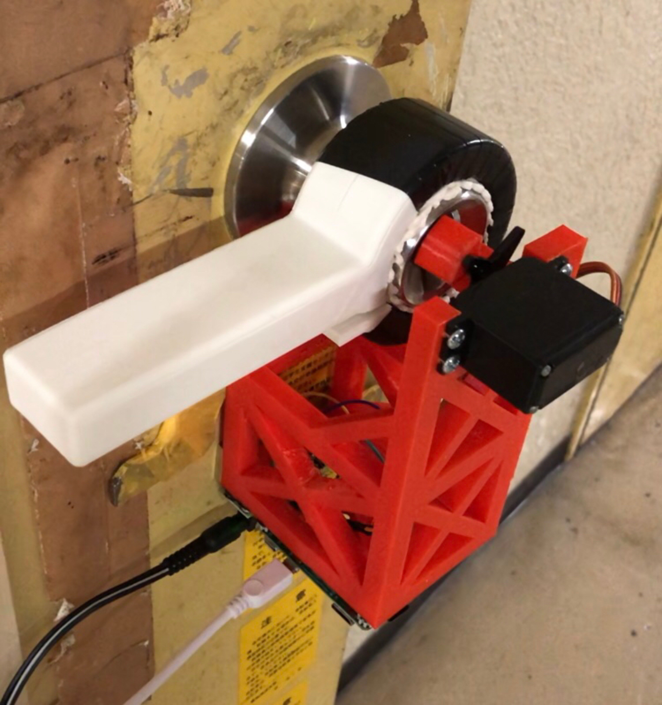

# 部室の鍵をICカードで開けられるようにした話

[UEC koken Advent Calendar 2021](https://adventar.org/calendars/6604) 16日目の記事です。今年の工研のドベカレは人が少ないため、私が最初になりますね。(サークルは元気ですよ！)

さて本題ですが、MMAには以前より交通系ICカードで開け締め出来る鍵、通称鍵シスが存在しました。工研にもこれが欲しいという要望も以前からあったものの、なかなか実現できずにいました。2年前の今日、工研のドベカレを書いたStearinさんも鍵シス制作に挑戦した先輩の一人でした。ちなみに[その記事](https://stea.hatenablog.com/entry/2019/12/18/013040)には鍵シス制作について書かれています。この記事はその鍵シスをとうとう完成させましたよというお話になります。

鍵シスを作ったとは言っても認証ソフト部分はStearinさんが完成させていましたので、私はサーボの制御コードを認証プログラムと組み合わせて、サーボの台座をちょこっとモデリングして3Dプリンタで印刷しただけです。私が制作に関わった期間は1週間程度で、短期で完成まで持ち込めたのは[KagiMod for Home](https://lnln.dev/works/KagiMod/) (自宅用のスマートロック)制作の経験のおかげだと思います。動いている様子は下の動画で見れます。

<blockquote class="twitter-tweet">
<a href="https://twitter.com/hashtag/%E4%BB%8A%E6%97%A5%E3%81%AE%E5%B7%A5%E7%A0%94?src=hash&amp;ref_src=twsrc%5Etfw">#今日の工研</a> 鍵シスできた <a href="https://t.co/bXGTiBfhZm">pic.twitter.com/bXGTiBfhZm</a>
&mdash; りんりん (@lnln_ch) <a href="https://twitter.com/lnln_ch/status/1460105078577131521?ref_src=twsrc%5Etfw">November 15, 2021</a></blockquote>  

今はこれらのスマートロックシリーズをキット化して販売できないかと考えています。
