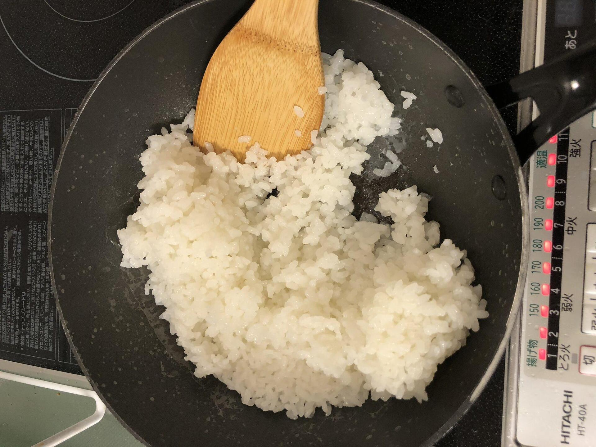

# もしものときにフライパンで米を炊く話

炊飯器がない、壊れた、だとかいうときにフライパンでご飯を炊く話。

1. フライパンにお米を入れ、水を入れる。一般的に炊飯する際の量で構わない。目安としては米に載せた手のひらが水で隠れるくらい。
2. 強火にかけ、沸騰させる。
3. 沸騰したら弱火に切り替えタイマーを15分にセットする。同時にスマホなどのタイマーを25分にセットしておくと良い。
4. 15分弱火にかけた後10分間放置して蒸らす。コンロにタイマー機能があればこの25分間は完全に放置できる。
5. よくかき混ぜて出来上がり。
