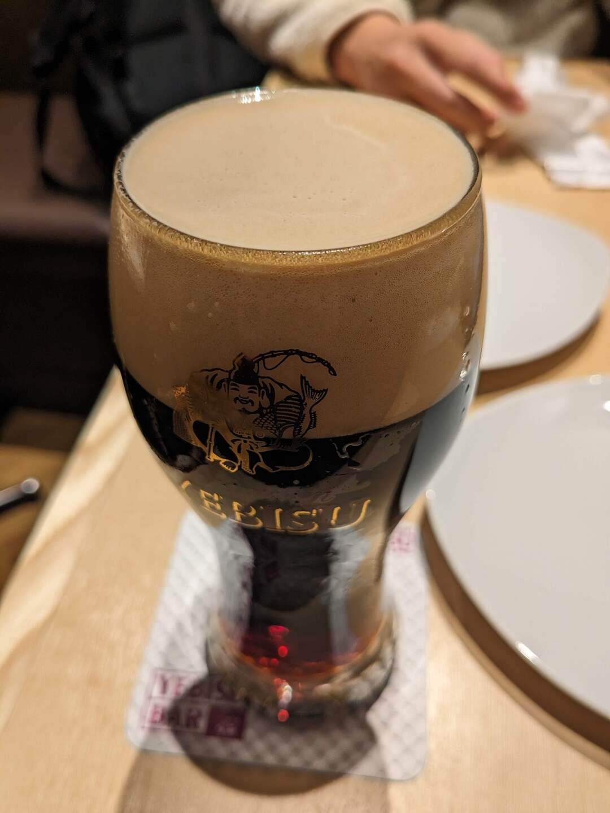

# 4日後に完成する車

> いつからだ……？ 他人のアドベントカレンダーを待つ様になったのは
>
> 一体いつからだ？ フォロワーが公開したadventar.orgに間を置かず リンクを貼れる様になったのは？
>
> そんなんじゃ ねェだろ！ オレが求めた 技術の情熱は

今年は一人でアドベントカレンダーを書くことにしました。25日も続かないとは思いますが、よろしくお願いします。一日目の記事は調布祭で作った車の話です。

- 次回記事「[CH32V003J4M6でneopixelを光らせる](../2023-12-04/)」

## 0日目

調布祭を週末に控えた11/20月曜日の夜、私はサークルの友人Gとビールを飲んでいました。我々のサークル(工学研究部)は引退とかそういったものはないのですが、大学も4年になると流石に老の害かなと思い、サークルの運営などには関わらないようにしていました。なので直前まで存じ上げなかったのですが、どうやら今年の工研の展示は西に追いやられているようで集客に心配がありました。そこでなにかインパクトの大きい物を作って集客につなげたいね、という話の流れになり、そこでGによって提案されたのが車だったわけです。

飲酒後、計画を練るために研究室に戻ったところ先輩と意気投合し、制作メンバーが増えた本事業は本格化していきます。はじめはターレットカーのようにステアリングと動力をまとめた設計にしようと考えていましたが、先輩と分業する関係上分離した方が良いということになり、私が動力部、先輩がステアリングを担当することになりました。

## 1日目

11/21火曜日です。火曜日は研究室のミーティングがあるので午後から活動開始です。まず仙川のホームセンターに行き適当なタイヤを探します。ここが第一の関門でした。

まずそもそも調布祭は週末に迫っています。MISUMIで追加工が必要な軸や歯車などの時間がかかる部品を使う余裕はありません。タイヤはキャスター用のベアリングがついていて、ボルトで軸が締められているものを用いることにしました。なんと都合の良いことにエアタイヤの大型キャスターが販売されていたので、これを用いることにしました。このほかボルト等も購入したかったのですが、まだCADも一切引いていなかったので、まずはタイヤだけ持ち帰って設計を固めることにしました。

そうして夕方から動力部の設計に入ります。手元に落ちていたテキトーなモータを使用することにしたのですが、これがなかなか後から大変なことになります。この時点で一度モータを単体で回してみたのですが、意外と回転数が低いと感じたのでうっかり調子に乗った私は増速しようと試みてしまいます。

## 2日目

11/22水曜日です。水曜日は大学院の先行履修科目があるので、この日も活動は午後からです。

前日に大方モデルが完成したことで必要なボルトの径や長さが確定したので再びホームセンターに向かいます。ちなみに、どうして調布のホームセンターではなく仙川に向かうのかと言いますと、調布のホームセンターはDIY関連の資材がしょぼいうえにアクセスが遠いためです。仙川のホームセンターは資材館も比較的充実しているうえ、駅から徒歩で近いです。

この日は18:00からさらに別の予定があったため、部品の購入後はまた時間をおいて夜からの作業に入りました。この週は研究とこいつの進捗のせいで睡眠時間が私にしては限界を迎えていました。普段は8～9時間ほど睡眠を取らないとまともに活動できないほどコスパの悪い私ですが、アドレナリン出まくりだったのでしょうか、この週は3～5時間の睡眠で戦っていたような気がします。

先ほども申し上げたとおり、加工などに時間のかかる部品は導入できません。上の3Dモデルで示されている赤い色の独自部品は全て3Dプリントです。しかし当然PLAのテキトーな3Dプリント品が人間の体重やトルクに耐えられるわけがありません。ここではいくつかの工夫を行いました。まず軸受のパーツにおいては荷重が積層の圧縮方向にかかるように配置しました。次に歯車は厚めに設計することで面圧を分散し、さらにインフィルを25%程度に増やし、外壁を6層にしました。外壁を6層にしたことで歯先のインフィルは100%、さらにキー溝にかかるトルクをインフィル100%の壁、しかもフィラメントの連続した方向で受けることが可能になります。

この日の夜、ステアリングの設計はまだ間に合っていませんでしたが、初走行試験を行いました。ところが、人を載せるとトルク不足で走行ができませんでした。正直絶望的でしたが、調子に乗って増速していたギア比を変えればなんとかなるかもしれないと思い、amazonで怪しいモータードライバを見切り購入しました。モータードライバもすぐ手に入ることを条件にするとamazonで販売されている中華製の怪しいものしかありませんでした。この日の夜(いや早朝か？)はかなり不安な気持ちでベッドに入りました。

## 3日目

11/23木曜日です。すでに調布祭の準備日に入っており、学内はお祭りムードです。しかし私は焦りと心配で少々ナーバスでした。再設計したギアで車が動かなければ終了です。ギアの大きさが割と大きいので、印刷にも時間がかかります。この間、シートの設計やコントローラのプログラミングを行っていました。

余談ですが、たまにプログラミングを避けたくてM科に行った人の噂を耳にします。この車ですらコードを書いているのに逃げ場なんてあるのだろうかとちょっと複雑な気持ちになってしまいます。やりたくないことを避けるためではなく、やりたいことをやるために進路を選んだ方がいい気がします。知らんけど。

正直記憶があやふやなのですが、この日はたしか印刷待ちですることがなかったのか、久しぶりにちゃんと眠れました。

## 4日目

11/24金曜日です。もう調布祭当日です。みんなお祭りをエンジョイしている中、私はまだ設計が間に合ってなかったステアリングを先輩と制作していました。なんやかんや拾い物のスラスト方向に耐えそうなベアリングと3Dプリント品を用い、アルミフレームに穴を開けて完成に漕ぎつくことができました。サークルにボール盤があってよかったです。

この日の夜やっと全ての部品が完成し、完全な状態で試験走行を行いました。一番心配であったトルク不足も、ギア比を変更後はなんとか解決しました。ほっとしました。

(完成！という一番華々しい日なのに写真が一枚もありません！悲しい)

## お披露目

11/25土曜日の朝、初お披露目です。大学に向かい、工研の展示スペースまで自走しました。(横断歩道の部分は公道なのでちゃんと降りて運びましたよ！)

途中、友人に偶然遭遇したので動画を撮っていただきました。ありがとうございます！この世のすべてに！

<blockquote class="twitter-tweet">
車作りました。西10で展示します。非常に危険なので体験はできないかな… <a href="https://t.co/npWMTqb7xs">pic.twitter.com/npWMTqb7xs</a>
&mdash; りんりん (@lnln_ch) <a href="https://twitter.com/lnln_ch/status/1728221282075070679?ref_src=twsrc%5Etfw">November 25, 2023</a></blockquote>  

## 感想

ブログの締めのセリフってむずかしいですね。普段から文章を書かず読まず、大学生として如何わしい生活を送っていることを深く恥じる次第です。

多くの来場者の方々にお褒めの言葉をいただき、大変嬉しかったです。特に嬉しかったのは本学のロボコンサークルであるロボメカ工房の皆さんに大きなリアクションで喜んでいただいたことです。ものづくりは自分でするのも楽しいですが、人の作品を見るのも楽しいです。またその両方、作品を見せあう仲間がいることが一番の幸せです。来年の新歓や調布祭がとても楽しみです。また、私の作品を見たちびっこが将来自分の手で何かを作り、世にアウトプットしてくれるかもしれないと思うと感極まる思いです。本当にありがとうございました。

