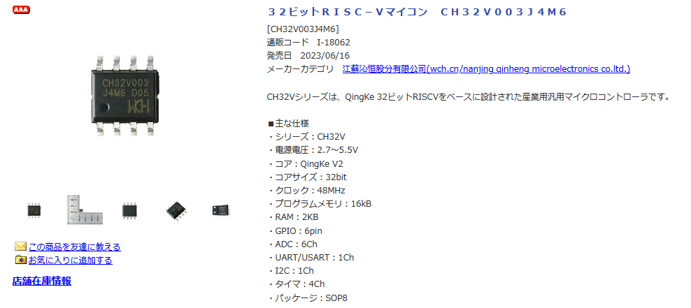
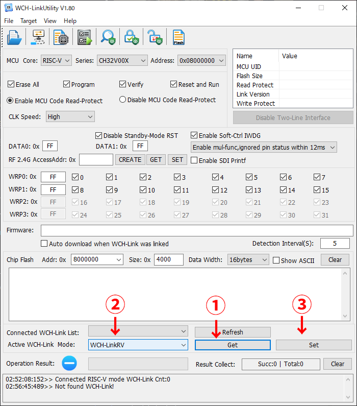
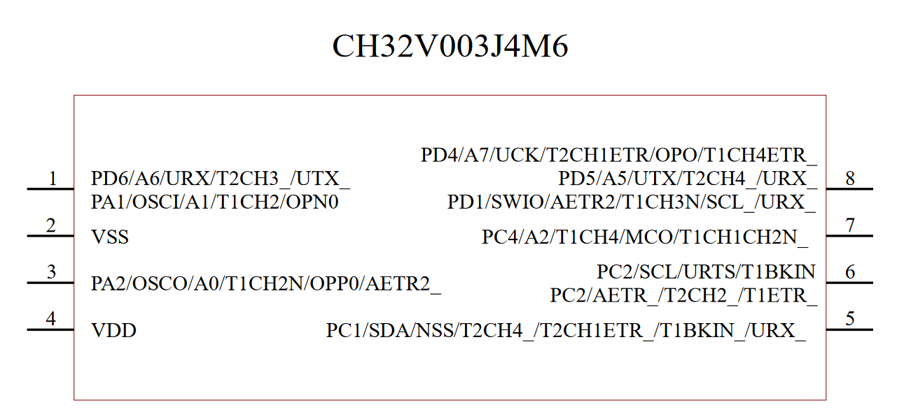
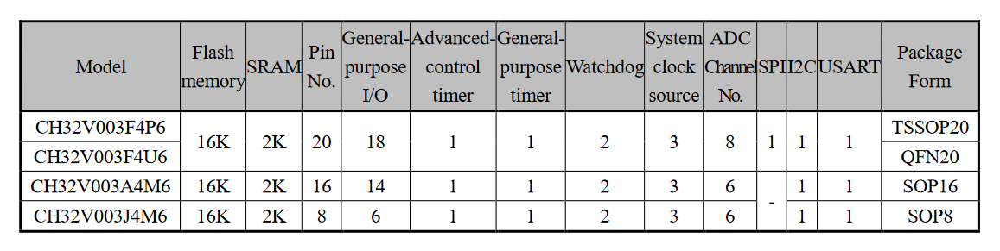

# CH32V003J4M6でneopixelを光らせる

オレオレひとりぼっちアドベントカレンダー4日目の記事です。前回(1日目)の記事は「[4日後に完成する車](https://lnln.dev/blog/2023-12-01/)」でした。ありがとうございます。

最善を目指して努力することは大切なことだと思います。完璧じゃなくても、その時の自分の最善を尽くせていれば悔いはないと思います。そして、その評価対象は現在であるべきです。過去の結果に対して最善であったかどうかを議論するのは不毛ですし、おおかた心を病んでしまう気がします。では、2日目と3日目のアドベントカレンダーを書かなかった、書けなかった私の現在のベストはなにか。それは過去を振り返らずに4日目の記事を書くことではないでしょうか。


## 動機

<figure><a href="000.png"></a><figcaption>秋月より</figcaption></figure>

今年なにかと話題になった[江蘇沁恒股分有限公司(WCH)](https://www.wch.cn/)のRISCVマイコン、会社名にあまりなじみがないよ～という方でもCH340なんかは聞き覚えあるのではないでしょうか。Arduino互換品のシリアル変換についていたりするやつです。とりわけ今回は[CH32V003J4M6](https://www.wch.cn/products/CH32V003.html?)を使っていきたいと思います。SOP8で小さくてけっこうパワフル、外部のクリスタルも要りません、なのに秋月でも40円で買えて安い(attiny10は60円)。電子工作初心者とは言わずともあまり強いとは口が裂けては言えないような私でも、いくらなんでもLEDのテープをキラキラさせるためだけにArduinoなんていちいち使いつぶして居られませんから、今回はこいつでシリアルのLEDテープを光らせたいと思います。


## 開発環境構築
### 散財
まず必要な物品は以下の通りです。とりあえず秋月とアリエクのリンクを貼っておきます。送料含めるとどっこいどっこいかな。

- CH32V003J4M6 <https://akizukidenshi.com/catalog/g/gI-18062/>, <https://ja.aliexpress.com/item/1005005143221495.html>
- WCH-LinkE エミュレーター <https://akizukidenshi.com/catalog/g/gM-18065/>, <https://ja.aliexpress.com/item/1005005996962195.html>
- SOP8 DIP変換基板 <https://akizukidenshi.com/catalog/g/gP-05154/>
- お好みのRGB LEDテープ
- LEDテープは5Vとか12Vとかで駆動するものが多いと思うので、電源も用意しておくとよいかも
- あとはジャンパ線とかブレッドボードとか

2023-12-04現在、すべて揃えても1000円程度です。ライタが750円と安いのもありがたいですね(pickitを眺めながら)。


### ライタの設定
それではまずライタの設定を行っていきます。<https://www.wch.cn/downloads/WCH-LinkUtility_ZIP.html>からWCH-LinkUtilityをダウンロードします。非常に残念なことにwindowsしかサポートされていないようです。Mode設定は毎回行う必要はないので、すこし我慢してWindowsを立ち上げます。WCH-LinkEをpcに接続したら図のように"Get"を押した後、"Mode"を"WCH-LinkRV"にし、"Set"を押します。

<figure><a href="001.png"></a><figcaption>順番に注意</figcaption></figure>


### コード開発環境
開発環境はいくつか用意されていて、私がぱっとみたところこんな感じ

- MounRiver Studio <http://www.mounriver.com/download>
    - 公式で用意されているIDE？Windows, Linux, MacOSに対応。私は試してない
- Arduino IDE <https://github.com/openwch/arduino_core_ch32/tree/main>
    - Arduino IDEの追加ボードのところに https://github.com/openwch/board_manager_files/raw/main/package_ch32v_index.json といれれば使える。
    - 私が試したところ、delayすらズレるような感じだったのですが、現在どうなっているか分かりません。
- ch32v003fun <https://github.com/cnlohr/ch32v003fun>
    - 今回用いるのはこれ


インストールは <https://github.com/cnlohr/ch32v003fun/wiki/Installation> を参考にやってください。どうやらWSLでもいけるようです。ubuntuなら以下の必要なソフトウェアをインストールしてch32v003funのリポジトリをクローンすれば終了です。

```shell
sudo apt install build-essential libnewlib-dev gcc-riscv64-unknown-elf libusb-1.0-0-dev libudev-dev

mkdir ch32v003fun
cd ch32v003fun
git clone https://github.com/cnlohr/ch32v003fun.git
```

私は次のようにch32v003をcloneしたディレクトリと同じ階層にプロジェクトのディレクトリを作成して管理してます。

```shell
ch32v003fun> tree -L 2
.
├── ch32v003fun
│   ├── LICENSE
│   ├── README.md
│   ├── attic
│   ├── build_scripts
│   ├── ch32v003fun
│   ├── examples
│   ├── extralibs
│   ├── minichlink
│   ├── misc
│   └── platformio.ini
├── softwareNeopixel
│   ├── Makefile
│   ├── funconfig.h
│   ├── main.c
│   └── softwareNeopixel.h
└── template
    ├── Makefile
    └── main.c
```

これに沿って、Makefileも次のように書き換えています。

```makefile
all : flash

TARGET:=main
CH32V003FUN:=../ch32v003fun/ch32v003fun

include ../ch32v003fun/ch32v003fun/ch32v003fun.mk

flash : cv_flash
clean : cv_clean
```

あとは`sudo make`すれば書き込みまで一気にやってくれます。クローンしたディレクトリ内で以下のコマンドを実行すれば、いい感じにudev-rulesが設定されてsudoは不要になります。

```shell
sudo cp minichlink/99-minichlink.rules /etc/udev/rules.d/
sudo udevadm control --reload-rules && sudo udevadm trigger
```

### 書き込み
ではライタを接続していきましょう。ここで嬉しいポイントなのですが、なんとこのマイコンは書き込みに1ピンしか使いません。楽すぎる。

| CH32V003J4M6 | WCH-LinkE |
|-|-|
| 2.VSS   | GND   |
| 4.VDD   | 3V3   |
| 8.SWIO  | SWDIO |


<figure><a href="002.png"></a><figcaption>データシート <a href="https://www.wch-ic.com/downloads/CH32V003DS0_PDF.html">https://www.wch-ic.com/downloads/CH32V003DS0_PDF.html</a> より</figcaption></figure>

## コード
ではやっとですが、neopixelを使っていきましょう。ch32v003funのexampleにはws2812bdemoというアドレサブルLEDのサンプルが用意されています。どれどれ…と覗いてみると


> Single-file-header for SPI-DMA to output WS2812B LEDs. By chunking the outputs using the center-interrupt, it is possible to double-buffer the WS2812B output data while only storing a few LEDs worth of data in memory at once.
> <https://github.com/cnlohr/ch32v003fun/tree/master/examples/ws2812bdemo> より

どうやらSPIを使っているらしい？ですね。しかしながらch32v003のj4m6にはSPIがありません…こまった

<figure><a href="004.png"></a><figcaption>データシート <a href="https://www.wch-ic.com/downloads/CH32V003DS0_PDF.html">https://www.wch-ic.com/downloads/CH32V003DS0_PDF.html</a> より</figcaption></figure>

ということで調べていると、ソフトウェアで実装している方を発見したので、少し改変して使わせていただきました。ありがとうございます。信号線はPC4に接続しています。

- [74th, ch32v003funでCH32V003を便利に開発している話](https://74th.hateblo.jp/entry/using-ch32v003fun)
- <https://github.com/74th/relay-switch-usbhub/blob/main/main-firmware/gpio_neopixel.h>

### softwareNeopixel.h
```c
/*
Copyright 2023 Atsushi Morimoto (@74th)

Permission is hereby granted, free of charge, to any person obtaining a copy of this software and associated documentation files (the "Software"), to deal in the Software without restriction, including without limitation the rights to use, copy, modify, merge, publish, distribute, sublicense, and/or sell copies of the Software, and to permit persons to whom the Software is furnished to do so, subject to the following conditions:

The above copyright notice and this permission notice shall be included in all copies or substantial portions of the Software.

THE SOFTWARE IS PROVIDED "AS IS", WITHOUT WARRANTY OF ANY KIND, EXPRESS OR IMPLIED, INCLUDING BUT NOT LIMITED TO THE WARRANTIES OF MERCHANTABILITY, FITNESS FOR A PARTICULAR PURPOSE AND NONINFRINGEMENT. IN NO EVENT SHALL THE AUTHORS OR COPYRIGHT HOLDERS BE LIABLE FOR ANY CLAIM, DAMAGES OR OTHER LIABILITY, WHETHER IN AN ACTION OF CONTRACT, TORT OR OTHERWISE, ARISING FROM, OUT OF OR IN CONNECTION WITH THE SOFTWARE OR THE USE OR OTHER DEALINGS IN THE SOFTWARE.

*/

#pragma once

#include <stdint.h>
#include "ch32v003fun.h"
#include <stdio.h>

static void neopixel_write(GPIO_TypeDef *gpio, uint16_t gpio_pin, uint8_t *data, uint32_t len)
{
    // lenがLEDの個数であった方がmainの見通しがいい気がしたので改変 (lnln_ch)
	len *= 3;

	uint32_t h = gpio_pin;
	uint32_t l = gpio_pin << 16;

	for (int i = 0; i < len; i++)
	{
		uint8_t c = data[i];
		for (int j = 0; j < 8; j++)
		{
			if (c & 0x1)
			{
				gpio->BSHR = h;
				asm("c.nop");
				asm("c.nop");
				asm("c.nop");
				asm("c.nop");
				asm("c.nop");
				asm("c.nop");
				asm("c.nop");
				asm("c.nop");
				asm("c.nop");
				asm("c.nop");
				asm("c.nop");
				asm("c.nop");
				asm("c.nop");
				asm("c.nop");
				asm("c.nop");
				asm("c.nop");
				asm("c.nop");
				asm("c.nop");
				asm("c.nop");
				asm("c.nop");
				asm("c.nop");
				asm("c.nop");
				asm("c.nop");
				asm("c.nop");
				asm("c.nop");
				asm("c.nop");
				asm("c.nop");
				asm("c.nop");
				asm("c.nop");
				asm("c.nop");
				asm("c.nop");
				asm("c.nop");
				asm("c.nop");
				gpio->BSHR = l;
				asm("c.nop");
				asm("c.nop");
				asm("c.nop");
				asm("c.nop");
				asm("c.nop");
				asm("c.nop");
				asm("c.nop");
				asm("c.nop");
				asm("c.nop");
				asm("c.nop");
				asm("c.nop");
				asm("c.nop");
				asm("c.nop");
				asm("c.nop");
				asm("c.nop");
			}
			else
			{
				gpio->BSHR = h;
				asm("c.nop");
				asm("c.nop");
				asm("c.nop");
				asm("c.nop");
				asm("c.nop");
				asm("c.nop");
				asm("c.nop");
				asm("c.nop");
				asm("c.nop");
				gpio->BSHR = l;
				asm("c.nop");
				asm("c.nop");
				asm("c.nop");
				asm("c.nop");
				asm("c.nop");
				asm("c.nop");
				asm("c.nop");
				asm("c.nop");
				asm("c.nop");
				asm("c.nop");
				asm("c.nop");
				asm("c.nop");
				asm("c.nop");
				asm("c.nop");
				asm("c.nop");
				asm("c.nop");
				asm("c.nop");
				asm("c.nop");
				asm("c.nop");
			}
			c = c >> 1;
		}
	}
}

```

### main.c
```c
#include <stdio.h>
#include <string.h>

#include "ch32v003_GPIO_branchless.h"
#include "ch32v003fun.h"
#include "softwareNeopixel.h"


#define LED_NUM 13

#define LED_PIN GPIOv_from_PORT_PIN(GPIO_port_C, 4)


void I2C1_EV_IRQHandler(void) __attribute__((interrupt));
void I2C1_ER_IRQHandler(void) __attribute__((interrupt));

void init_rcc(void) {
    RCC->APB2PCENR |=
      RCC_APB2Periph_GPIOA | RCC_APB2Periph_GPIOC | RCC_APB2Periph_GPIOD;
    RCC->APB1PCENR |= RCC_APB1Periph_I2C1;
}

void init_gpio() {
    GPIO_port_enable(GPIO_port_C);
    GPIO_pinMode(LED_PIN, GPIO_pinMode_O_pushPull, GPIO_Speed_10MHz);

    GPIO_digitalWrite_0(LED_PIN);
}


void setBufferRGB(uint8_t r, uint8_t g, uint8_t b, uint8_t *buffer, uint32_t offset) {
    offset *= 3;

    buffer[offset] = g;
    buffer[offset+1] = r;
    buffer[offset+2] = b;
}

int main() {
    uint8_t colorData[3*LED_NUM];

    SystemInit();
    init_gpio();

    Delay_Ms(100);

    while (1) {
        for(uint8_t i = 0; i < LED_NUM; i++){
            // RGBで色を設定してバッファに入れておく
            setBufferRGB(0, 0, 155, colorData, i);
        }

        // 書き込み
        // LEDテープの信号線をGPIOのPC4に接続
        neopixel_write(GPIOC, GPIO_Pin_4, colorData, LED_NUM);
	}

}

```

## 光った

<blockquote class="twitter-tweet"><p lang="ja" dir="ltr">ch32v003j4m6でneopixel使えたので舞ってる。安価な光り物工作に役立ちそう <a href="https://t.co/NH3Y3AMLOf">pic.twitter.com/NH3Y3AMLOf</a></p>&mdash; りんりん (@lnln_ch) <a href="https://twitter.com/lnln_ch/status/1720325369126101477?ref_src=twsrc%5Etfw">November 3, 2023</a></blockquote> <script async src="https://platform.twitter.com/widgets.js" charset="utf-8"></script> 

## まとめ
というわけで私はほとんど何もしていないので技術記事と呼ぶにはお粗末な気もしますが、ch32v003j4m6でneopixelをキラキラさせることに成功しました。割とリッチなFlash memoryやSRAMがあるのにこれだけのために使いつぶすのもこれまた少し良心が痛むような気がしますが、安いのでもうこれでいいです。SOP8サイズなのでLEDテープの端っこについていても邪魔になりませんし、安いし、LED遊びにいかがでしょうか。ちなみに私はこの遊び程度でしかこのマイコンも開発環境も触っていないので、あまり自信がないです。間違ってたらごめんなさい。