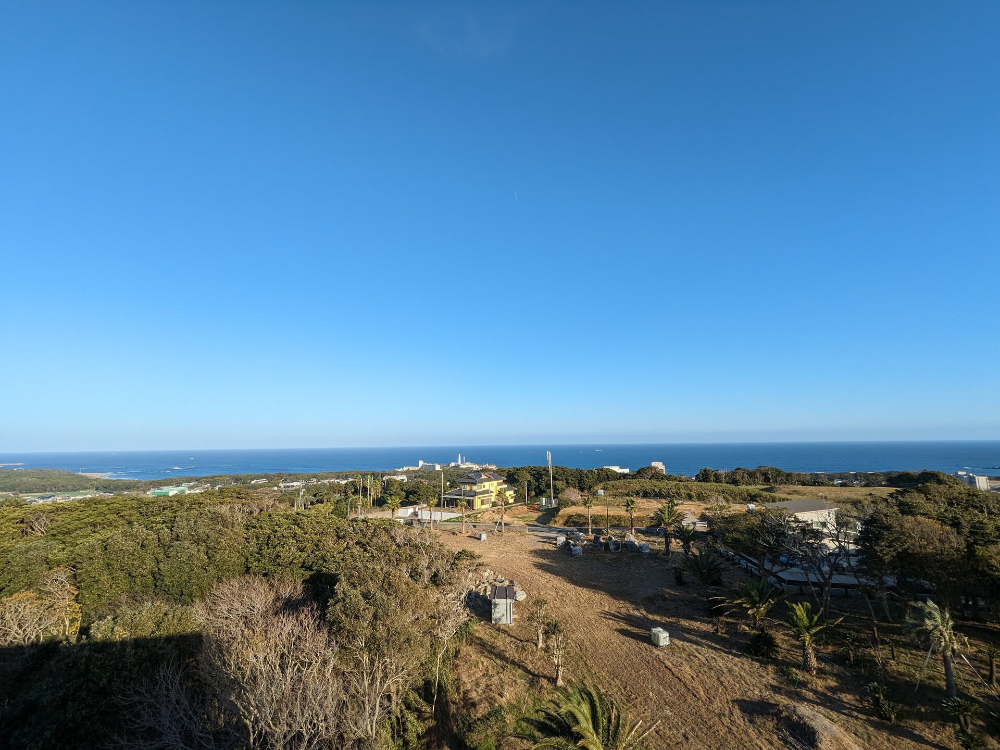
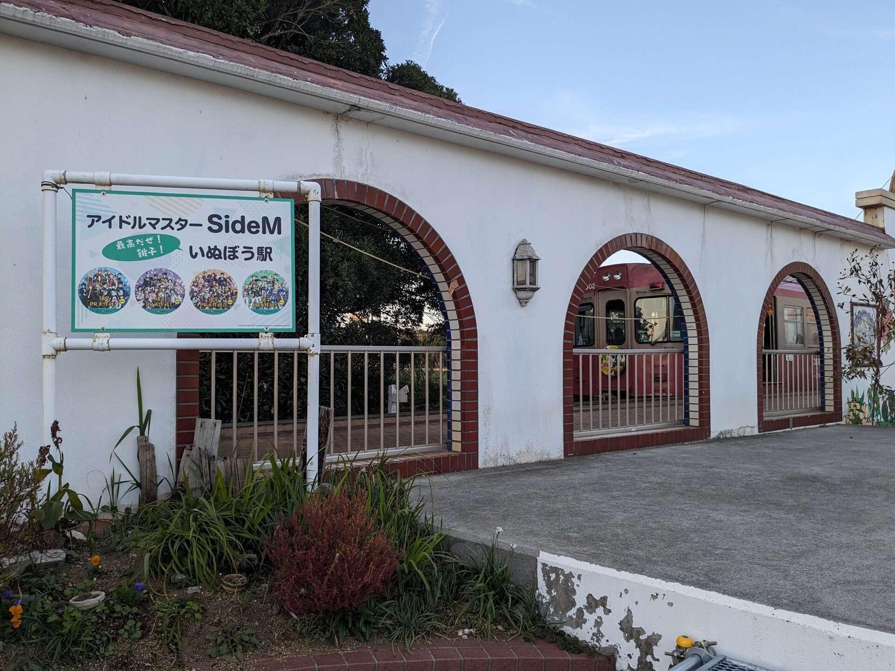

# 銚子日帰り逃避旅行

オレオレアドベントカレンダー10日目の記事です。

- 前回記事「[CH32V003J4M6でneopixelを光らせる](../2023-12-04/)」
- 次回記事「未定」

みなさんは突如どこかに逃避したくなったことはあるでしょうか。知らない土地に出向くと自身がその地域の社会とはまるで全く無関係に存在しているように思われて、現実から逃避することができると私は感じるのです。そんなことで私は旅行が趣味の一つなのですが、卒研に圧迫される今日は絶好の旅行衝動日和でありました。

## 出発 (AM8:00)

銚子という街は私の住む町からは少々行きにくい場所にあるため、今回は友人を誘いレンタカーで向かうことにしました。林立する きぬた歯科の看板をかいくぐり、我々は卒業研究を置き去りにします。

## 九十九里浜

まずは道中、九十九里浜で休憩です。アニメ、プラネテスのオープニングで主人公が颯爽と駆け抜ける道はもう少し南側のようです。12月の九十九里浜に打ち寄せる波には、ビッグウェーブに魅せられた人影がまだ少し残っていました。

いつかプラネテスの聖地巡礼もしたいので人類の皆様には一刻も早く月面に都市を築いていただきたいところであります。九十九里浜での休憩後は友人の希望によりイオンに寄り道をしながら銚子市に突入していきます。

## 銚子市立銚子高等学校

銚子市内最初の観光地は銚子市立銚子高等学校です。こちらはアニメ、ゲーム、アマガミの主人公たちが通う高校のモデルとなった高校です。当然なかには入れませんが、入り口付近の有名なカットを確認しました。文化祭の日には中に入れるようで、そちらの詳しいレポートを行っている方([TB絢宮のブログ, アマガミ聖地巡礼 銚子市立銚子高等学校編 2日目](https://tb-ayamiya.hatenablog.com/entry/2019/06/27/215924))を見つけました。内部もかなりインスピレーションを受けているようですね。

## 名前のない場所 (上野町交差点周辺)

高校から道なりに進んでいくと、アマガミのエンディングに使われている場所にたどり着きます。特に目印があるわけでもなく、ただの住宅とキャベツ畑が広がっているのみなので、そのなんでもなさゆえに巡礼が困難な場所の一つかもしれません。

## 銚子マリーナ海水浴場

こちらはアマガミで七咲逢が膝枕をしてくれるシーン。正直あまり記憶がなく、アニメを復習せずに来てしまったことを後悔しています。

## 地球の丸く見える丘ふれあい広場

主人公がクラスの女の子との約束をすっぽかされた場所のモデルらしいのですが、確認してみたところ屋根のデザインなどがだいぶん異なっていました。ちなみにこのすっぽかしエピソードの裏話も面白いので、ぜひゲームをプレイ、アニメを見てください。

せっかくなのでついでに展望台も登ってみました。銚子半島を一望できて楽しいです。銚子半島は東西10km、南北2,3km程度しかない小さな半島です。しかしながら豊かな農地と水産業があり、温泉や古い地層から見られる化石、地域の電鉄など、ゲームのマップのような充実度があってとても楽しい街です。

## 銚子電鉄いぬぼう駅

地球の丸く見える丘ふれあい広場の最寄り駅である犬吠駅です。こちらでお土産のぬれ煎餅を購入しました。今回は電鉄に乗車する時間はなかったのですが、次回来るときはこれに乗って市内観光したいですね。

## 回転寿司･魚料理 島武

お昼は犬吠駅近くの島武で回転寿司を食べました。

ビンデカ…？私の知らないネタでしょうか、と思い注文してみることに

デカすぎる何かが届きました。そう、ビンデカとは"ビン"ちょうマグロの"デカ"いやつ、という意味だったようです。小学生の手のひらくらいはあろうかというネタは、厚みも7,8mm程度あり、これ一つで腹が膨れてしまうほどでした。

ふと冷静に回転レーンを見てみると他のネタも異常にデカいことに気づかされます。デカいエビなんかは握りと呼ぶのに無理があるでしょう。エビがシャリに乗っているというよりは、エビがシャリを抱えてやってきたという具合です。おなかが一杯になったところで、最後に行きたかった場所に向かいます。

## 君ヶ浜しおさい公園

こちらは七咲逢がイナゴマスクのアクションベルトで変身ごっこをするシーンの場所です。

成田へ向かう飛行機がたくさん飛来する空、元旦には初日の出を見に来る観光客で混雑するそうです。

以前福岡に旅行に行った際、帰る前に温泉に入ると嬉しくなれることに気づいたので、今回も温泉に入って〆にしたいと思います。

## ホテルニュー大新

こちらのホテルは日帰り入浴が可能、さらには2023年においてもアマガミの交流ノートが存在するという情報を聞きつけたので行くことにしたのですが、とはいってももう2023年です。2009年にゲームが発売されてから14年、2010,2012年にアニメが放送されてから10年以上も経過している作品ですからいつ撤去されていてもおかしくはないでしょう。そうして不安を抱えつつもホテルにたどり着いた我々でしたが、私たちはこの施設を全く誤解していました。アマガミの交流ノートはもちろん、ここにはこの国から失われつつある旅館の姿が残っていました。

交流ノートにサインを残して温泉に入ります。なんとこの日は5人ものアマガミファンが訪れていました。本当に2023年か？温泉を出ると"旅館のゲームセンター"があります。もはや文化財です。

特に驚いたのはこちら、FAMICOM BOXと光線銃シリーズです。ブラウン管の走査線を利用して銃口の指す画面上の位置を計算しているそうです。なんというテクノロジー……。しかもこのFAMICOM BOX、動きます。

> 任天堂が業務用として開発した商品で、本体右横に付いたコインボックスに100円を入れると一定の時間内（10分か15分）で内蔵された最高15種類のゲームを選択してプレイすることが出来きます。当時、主にファッションホテル（ラブホ）や旅館に設置され、もちろんまだ現役で活躍する本体もありますが、その数はかなり少なくなってきていると思われます。参考までに、本体は一般には売り出されませんでした。
> Kenvo, 業務用ファミコンボックス（FAMICOMBOX）の消息は・・・？, <http://www.famicombox.jp/aboutFB1.html>

## さいごに

駆け足になっていしまいましたが、銚子を後にすることになりました。旅行記を書くのは難しいですね。

今回の旅程は当日まで計画も立てずに行ったため、まだ多くの聖地を回れていません。また銚子市内はアマガミの聖地だけでなく、銚子電鉄やポートタワーなどの観光地も多くあります。今度は宿泊込みで余裕のある日程で訪れたいです。

