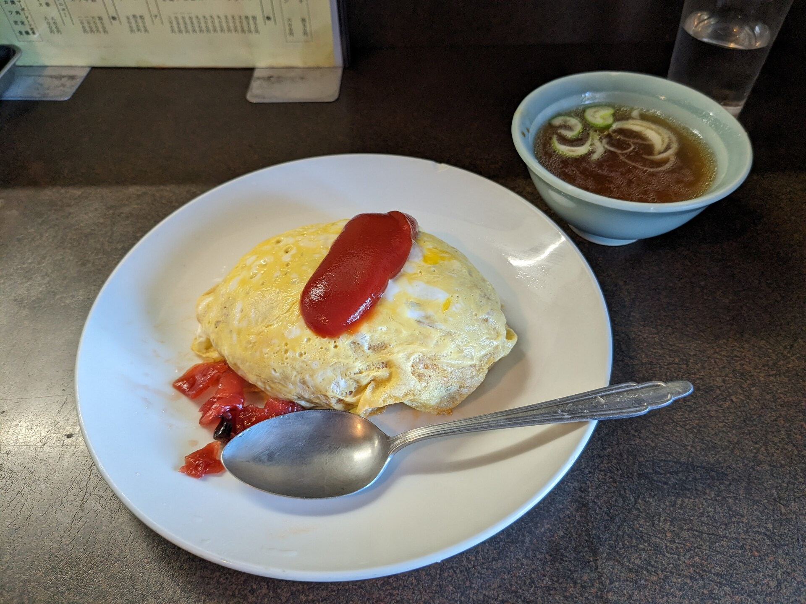
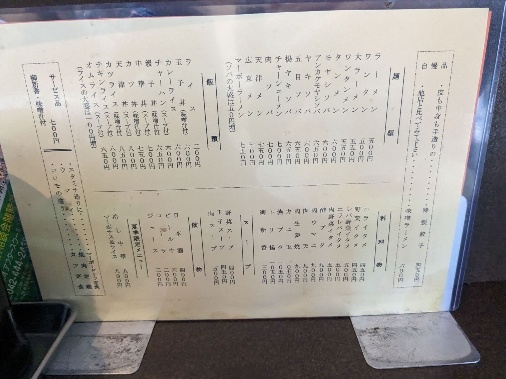

# 電通大生は「おはら」に行け

結論: オムライスが旨かった

私はまだ食していないが、噂によるとチャーハンなどのご飯ものが美味しいらしい。店内は広くなくカウンター席がメインで、2人がけのテーブル席が1つあるのみである。お昼時は混雑しており忙しそうで対応が雑になるため、初めて行くなら少し時間をずらしたほうが良いかもしれない。

行こう！今すぐ！！電通大生は調布に4年か6年かあるいはもっとかもうなんだか何年住むのか知らんけど、多くの電通大生はどうせ調布に住み着きやしないんだろう。いや、調布に住み着くにしたって、いつまであるか分からないんだ。おはらの美味しさに気付くのが閉店の日だったら悲しいじゃあないか。だったら後悔しないうちに行くべきじゃないか？いま行くんだよ！！！

> DO IT! JUST! DO IT!
> Don't let your dreams be dreams.
> Yesterday, you said tomorrow.
> So, JUST DO IT!!!!!
> From #INTRODUCTIONS (2015) by LaBeouf, Rönkkö & Turner; <https://vimeo.com/125095515exit> CC-BY 2.0

## メニュー (2024年02月07日現在)

## 位置情報

ここ→<https://maps.app.goo.gl/647f6t68UgciGLc19>

<iframe src="https://www.google.com/maps/embed?pb=!1m18!1m12!1m3!1d3241.8923268289204!2d139.54216817578657!3d35.65502437259563!2m3!1f0!2f0!3f0!3m2!1i1024!2i768!4f13.1!3m3!1m2!1s0x6018f014431d9d3f%3A0xbd66ba7f8b7f28ba!2z44GK44Gv44KJ!5e0!3m2!1sja!2sjp!4v1707275923583!5m2!1sja!2sjp" width="600" height="450" style="border:0;" allowfullscreen="" loading="lazy" referrerpolicy="no-referrer-when-downgrade"></iframe>