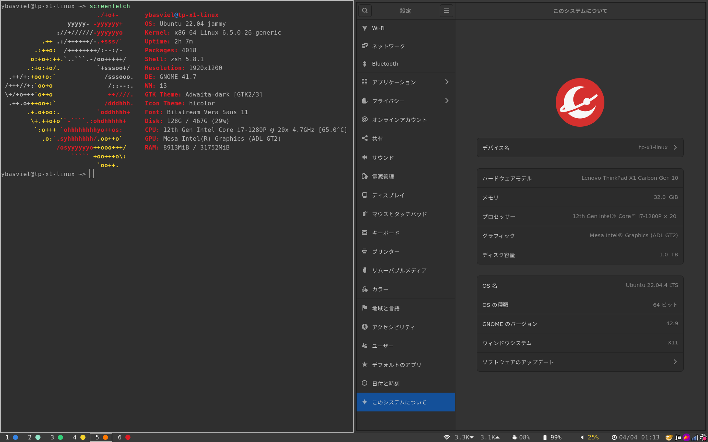

# 工研新歓ブログリレー2024 〜パソコンいじりの話〜

これは電気通信大学工学研究部の新入生歓迎ブログリレー 3日目の記事です。

- 前回: [へる さん「技術力マイナスの状態からの工学研究部への入部のすゝめ」](https://helkun.dev/blog/koken-shinkan2024/)
- 次回: [ゆい さん「電通大生活を快適に送るためのTips」](https://yuino.dev/blog/2024002/)
- 次々回: [みみ さん「自宅鯖を始めてみたら意外と面白かった」](https://zenn.dev/ueckoken/articles/83a7606a8ec96d)

## はじめに

今年度で大学院1年を迎え、新型コロナウイルス感染症の活動制限下に始まった私のサークルライフも、新陳代謝の激しい大学サークルにおいてはもはや歴史になろうとしていることでしょう。記憶も曖昧になりつつありますが、たしか当時の入学書類の中には中村淳先生の挨拶が入っており([このPDFと同様のもの](https://text.univ.coop/puk/START/nus_common/webapp/data_file_im/html_file/uec/21%E4%B8%80%E8%88%AC%E7%94%9F%E5%90%91%E3%81%91%E6%8E%B2%E8%BC%89%E7%94%A8%E8%A1%A8%E7%B4%99%E3%81%A8%E3%83%91%E3%82%BD%E3%82%B3%E3%83%B3.pdf))、そこに入学後のPCのお話があったことを記憶しています。そこには「OSはMacでもWindowsでも良いです。Linuxを使ってみるのも良いでしょう」なんてことが書いてありました。これを真に受けた私は「流石やはり電通大の学生はみんなLinuxを使うんだな」と思い、大学用に購入したPCにlubuntuをインストールした記憶があります。実際には多くの学生がWindowsかMacを利用しているため、これは全くの誤解であったのですが、なんと当時の工研の同期はほぼLinuxユーザーが占めており、私の夢に見た大学生活がついにここから始まったのであります。とかなんとか言っても私は にわか を自負しているので大した内容はないのですが、今回はそんな私のパソコンいじりの話をしたいと思います。

> 大学の初年次の情報系必修科目ではUNIXシステムが使われますので、WindowsでもMac OSでもなく、Linux OSをはじめから使う、という別の選択肢もあります。Linuxはそもそもオープンソースのマインドから生まれていますので、様々なフリーのソフトウェアを利用することができます。Linuxを使うのであれば、マシンは何でも大丈夫です。ウェブなどの情報を頼りに自分でOSやソフトウェアをインストールしなくてはなりませんが、そんなに難しくはありませんので心配しないで！
> 
> 中村淳, 新入生の皆さんへのメッセージ, 2021年度 新入生の皆様へ 電通大生協推奨コンピュータセットのご案内

## はじめてのThinkPad X1 Carbon

私が入学時に購入したラップトップはThinkPad X1 Carbonです。たしかGen9を使っていたと思います。スペックはうろ覚えですが以下のとおりです。

- CPU i7-8265U
- メモリ 8GB
- ストレージ 512GB
- 重量 1.09kg

ThinkPad X1 Carbonには大満足でした。その利点はなんといっても重量が軽いことです。オンラインに始まった私の大学生活ですが、2020年の10月には登学が始まっていたため、この軽量さには大変救われました。しかしメモリをケチったことは大失敗でした。ブラウザとzoomを同時に開きながらvscodeを開いて授業課題をやったり、趣味で3DCADをやると8GBじゃあすぐいっぱいになってしまいます。そこで3年生の終わり頃に買い換えることにしました。もちろん機種はThinkPad X1 Carbonです。

## 2度目のThinkPad X1 Carbon

以下が私の現在利用しているラップトップのスペックです。

- CPU i7-1280P
- メモリ 32GB
- ストレージ 1TB

なかなか奮発したスペックになってしまいましたね。2年の中頃にデスクトップPCをメモリ32GBで組んだこともありメモリが32GBないと耐えられない体になってしまったのですが、メモリを盛るとCPUも上位モデルしか選択できなくなってしまい、結果的にこのようになってしまいました。なお、先代の子はじゃんぱらで売りました。ありがとう〜

## OSとかデスクトップ環境の遍歴

入学時は先にお話ししたとおりLubuntu18.04を使っていました。理由はLXDEが非常に軽量だったからです。デスクトップという最低限の環境のためにメモリを割きたくないという思いでした。しかしサークルで友人と出会いi3wmを布教された私はまんまと騙され、Lubuntuにi3wmを入れて運用し始めました。i3wmはタイル型のウィンドウマネージャなので、ウィンドウを開くと自動的に全画面でタイル状に並んでいきます。これのおかげでウィンドウ間をキーボード操作のみで移動できる他、ラップトップの限られた画面領域を余すことなく利用することができるというメリットがあります。以下のgif画像ではrofiを用いたソフトウェアの起動も行っています。

もっとも長く使ったのはAUR(Arch User Repository)にあこがれて入れたArchベースのmanjaro + i3wmです。Archはレベルが高いよ〜という私でもGUIつきのインストーラーで簡単にセットアップして使えます。また、manjaroはいろんなデスクトップ環境のイメージが配布されているのもうれしいポイントです。

研究室に配属後、なんだかUbuntuのほうがROS/ROS 2の開発がやりやすそうだぞということで[Regolith Desktop](https://regolith-desktop.com/ja/)(Ubunutu + Gnome + i3wm)を使い始めました。GnomeがいらっしゃるおかげでGoogle Driveがマウントできたりして、なんだがリッチです。

まとめるとこんな感じ

1. [Lubuntu](https://lubuntu.me/)
2. Lubuntu + i3wm
3. [manjaro + i3wm](https://manjaro.org/download/)
4. [Regolith Desktop](https://regolith-desktop.com/ja/)(Ubunutu + Gnome + i3wm)

## シェルのお話

サークルではfishが流行っていた気がするのですが、ここだけはちょっと逆張ってzshを使っています。[こちら](https://github.com/ybasviel/my-zshrc)に私のzshrcをおいておきます。なんだかいろいろまぜこぜにしていて、自分でもなんだかよくわからないのですが、以下の機能がバリ便利です。

- tab補完を強化
    - 補完候補をtabやC-f,b,n,pで移動
    - あいまいな入力補完
- C-n,pで入力途中のコマンドの後方部分だけ履歴をたどる

## さいごに

うっかりブログリレーに手を挙げてしまったがためにあわてて夜中にこれを書いていますが、そろそろ気力がなくなってきたのでここで打ち切りにします。遅れてごめんなさい。電気通信大学はみなさんの楽しいLinuxライフを応援しているはずです。きっと…