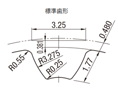

# 3Dプリントでタイミングベルトとプーリーを作る

100%完全に3Dプリント品だけでタイミングベルトとプーリーを作ってみたら案外うまくいったので、その備忘録です。

## タイミングベルト/プーリーの規格

タイミングベルトの規格についてはここでとやかく説明するよりも、ミスミのサイト(<https://jp.misumi-ec.com/special/timing_pulley/about/>)を参考にされた方が詳しく、わかりやすいと思われます。メートル規格のものでピッチの選択肢が豊富なS歯形のものを今回は作りました。

## 3Dモデリング

### プーリ

<https://jp.misumi-ec.com/vona2/detail/110300406030/>を参考にS5Mタイプの歯数30、ベルト幅10mmのものを作成したいと思います。

ピッチ円と歯先円、歯元円を引きます。ピッチ円直径はピッチpと歯数Zよりp\*Z/3.14となります。今回は5\*30/3.14=57.325になりました。

図のように円弧を引いて、図2を参考に寸法を入れていきます。

歯先円を押し出します。ベルト幅は10mmなのですが、10mmちょうどで印刷するとプリントの都合上うまくはまらないので余裕を持たせて11mm押し出しています。

もう一度スケッチを選択して、歯を削りだします。

フィレットをつけます。図2を参考に、歯元が0.25mm、歯先が0.55mmです。

円状パターンで歯数Z=30分コピーします。

これでおおむね完成です。ここから先は3Dプリント用に少し変更しました。

歯先円をスケッチして、45°のテーパーをつけて1.2mm押し出します。これを両側につけて完成です。

歯先円から45°のテーパーをつけることで、3Dプリントの際にサポード材が不要になります。

以上で完成です。私はFusionのパラメータ機能をつかって、以下のようにパラメータを変更するだけで任意のプーリが作れるようなテンプレートを作成しています。

### ベルト

<https://jp.misumi-ec.com/vona2/detail/110302653030/>こちらを参考にS5Mタイプのベルト幅10mm、ベルト周長400mm(歯数80)のタイミングベルトを作成します。

ピッチ円と歯先円、歯元円、外径を引きます。(便宜上、円と呼称しますが、制作しているのはベルトなので正しくはないような…)ピッチ円直径はピッチpと歯数Zよりp\*Z/3.14となります。今回は5\*80/3.14=125.796になりました。

図12を参考に以下のように寸法を入れていきます。

外径と歯元円のドーナツ形状を押し出します。ベルト幅10mmで押し出します。

もう一度スケッチを選択して、歯を押し出します。

フィレットをつけます。図12を参考に、と思いきやなぜか寸法が載っていないので憶測で0.25mmにしました。

円状パターンで歯数Z=80分コピーします。 

完成です。ベルトもプーリと同様にパラメータを設定しておくと、簡単にいろんな寸法のベルトが作れて便利だと思います。

## 3Dプリント
### プーリ

この記事の通り作っていればオーバーハング部分もサポート材なしで造型可能だと思います。歯の折損が怖いので、外壁を多めにしておくと良いと思います。

### ベルト

特に注意することはありません。TPUはベッドの接着が強いので、スティックのりを塗っておくと剥がしやすくなってよいでしょう。

### 完成品

これはS8Mですが、印刷した状態はこんな感じです。

