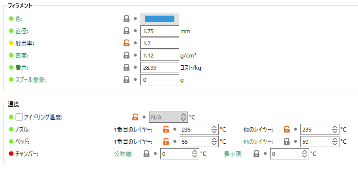

# Ender-3 S1におけるeSUN eLastic(TPE-83A)フィラメントの印刷設定

eSUN eLastic(TPE-83A)はTPUにくらべて非常に柔らかく、ゴムっぽい摩擦もあるフィラメントですが、その柔らかさゆえに印刷に苦戦しました。印刷に成功したパラメータを記録しておきます。使っているスライサーはPrusa Slicerです。

検索してもこれくらいしか先人の知恵が見つからなかったので、これを参考にしました。

> The printer I'm using is an Ender 5 S1, with creality slicer.
>
> Printing temp is 235 and bed temp is 50. Print speed is 22mm/s. Flow is 120 (only seems to extrude and print when set to 120 flow rate) Cooling and retraction are off.
> 
> kdturner, ESun eLastic TPE-83A : r/FixMyPrint, <https://www.reddit.com/r/FixMyPrint/comments/14ebgsi/esun_elastic_tpe83a/?rdt=60105>

## 印刷設定

### プリント設定

#### 速度

全体的に遅めです。10～20 mm/s程度まで落としている人もいるようですが、流石に印刷時間が我慢ならんのでこのくらいにしています。

#### モード||アドバンスド

一層目がすかすかしていたので射出幅を太めにしました。

### フィラメント

#### フィラメント

射出率を1.2に、温度はベッドを235℃、ベッドを50℃。

#### フィラメント上書き

リトラクト速度を遅くしています。TPUのようにリトラクトの長さを大きく取りたいところですが、詰まってしまうので、断念しました。

## その他

私はPEIプレートで造形していますが、ベッドへの定着がとても強いのでスティックのりを塗っておくと剥がしやすくなって良いと思います。私はシワなしピットGを使っています。パリッとはがれて気持ちいいです。

<https://www.tombow.com/products/shiwa_nashi_pit/>

