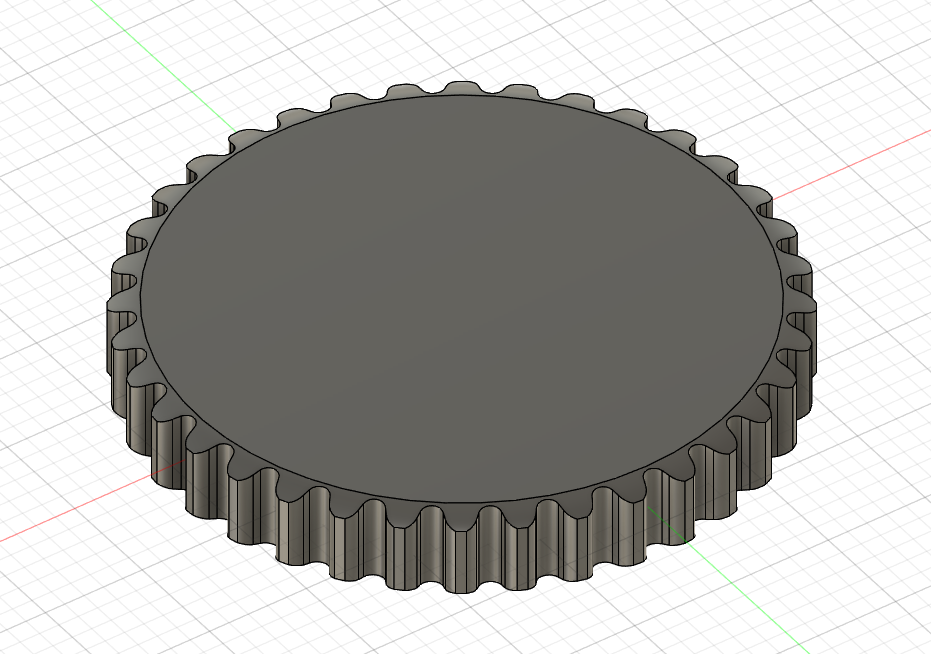

# 3Dプリントでスプロケットを作る (Autodesk Fusion)

以前、[3Dプリントでタイミングベルトとプーリーを作る ](https://lnln.dev/blog/2024-07-20/)という記事を書いたらスクショ祭りで非常につらかったので、本当はもうやりたくないんですけど、自分用のメモというか、人に聞かれたときのために書こうと思いました。

内容としては参考にした[Horio Kazuhiko(kukekko), FreeCAD 0.17.13208で、スプロケットをモデリングする (2024-11-06参照)](https://freecad.vdlz.xyz/tutorial/MachineElements/Sprocket/Sprocket.html)とほぼ同一なので、不明瞭な箇所はそちらも合わせてご覧ください。

## 寸法

こちら<https://www.did-coltd.com/pdf/111-115.pdf>を参考にしました。

今回はつぎのパラメータで作成していきます。

- ピッチ P: 12.5mm
- ローラ外径 Dr: 5mm
- 歯数 Z: 36

したがって、図1より

- ピッチ円直径 Dp: P / sin(180 deg / Z) = 143.421
- 標準外径 Do: ( 1 / tan(180 deg / Z) + 0.6 ) * P =150.376

## モデリング

参考元のサイトでは歯を1枚ずつ押し出していたのですが、Fusionでそれをやると一時的に歯数の分だけモデルが生成されて激重なので、円板を切り出していく方式でやります。

まず、標準外径の円板を押し出し

円板の側面をカット。ここの詳細な寸法の決め方が良く分からないかったので、適当にカットしています。カットはしたらミラーで両面に適用。

外円に垂線をおろし、ピッチ円と垂線の交点に
Dr * 1.005 + 0.076 mm = 5.101 mm
の円を書く

外円に引いた垂線から180 / Z  = 5 degのところに半径を引き、先ほど引いた小円の中心から水平線を引く。さらに水平線から180 / Z  = 5 deg下げたところに1.4 * Dr = 7mmの線を引く。

小円に接する線を引き、そこに先ほど引いた直線の先端から垂線を下す。

また、反対側にも図のように線を引き、先ほどの直線に垂線を下す。
寸法は
180 - 35 + ( 60 / Z )  = 143.3 deg
18 - ( 56 / Z ) = 16.4 deg
0.8 * Dr = 4 mm

つぎのように円弧と直線を引く。

これで歯の半分は描けたので、ミラーで転写する。

最終図面

削った後、全周に歯数の数だけコピーして完成

