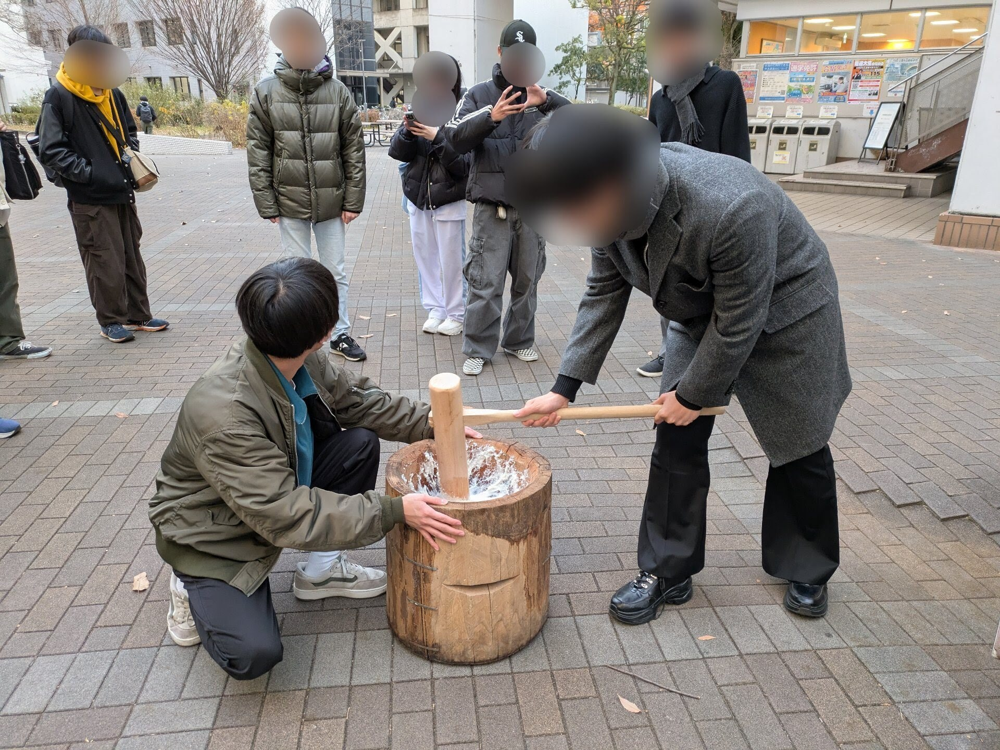
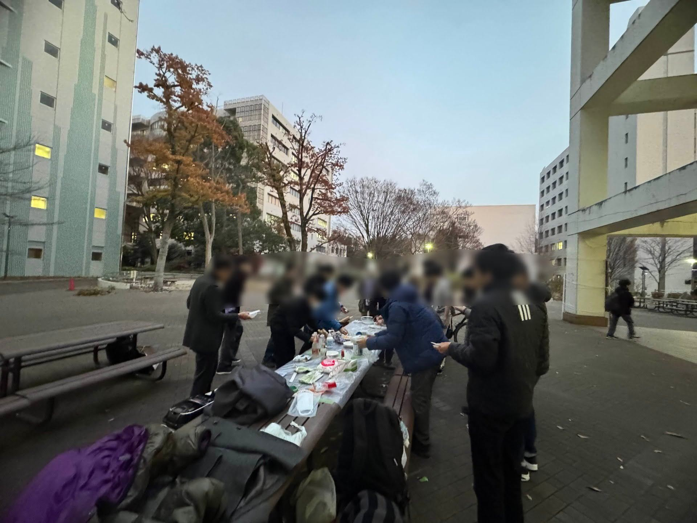
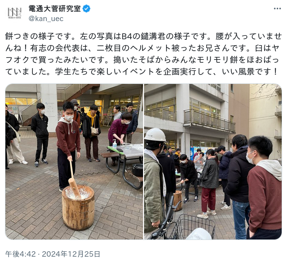

# クリスマスに大学で勝手に餅つきをした

## 概要
2024年12月25日クリスマス、なかがわ電機サービスと複数名の有志により、電気通信大学の学内で勝手に餅つきを開催しました。ここにその記録を残そうと思います。

## メンバーと担当

- なかがわ電機サービス(りんりん)
    - 立案、計画、出資
- 尾瀬 さん
    - 物品調達、ポスター作成
- 淵野アタリ さん
    - 炊飯器供出

## 計画立案
立案は本サークル(なかがわ電機サービス)のりんりんが行いました。学内で学部生とか、院生とか、先生とか、いろんな所属の人がぺったんぺったん餅をついていたら面白いんじゃないか、という発想から本企画は始まりました。

イベントには話題性が重要です。内容がいい企画でも人が集まらなければ悲惨です。そのため、話題性を喚起するために日程をクリスマスに定めました。クリスマスのように名前のついた記念日であれば口伝しやすく、印象に残りやすいと考えたためです。

> いいものなら売れるなどというナイーヴな考え方は捨てろ
> 久部緑郎, らーめん才遊記, 9巻, 第88話「濃口ラーメン・解!!」

## 物品調達
計画が定まったので臼と杵の購入です。尾瀬さんがアマゾンで新品の杵を、ヤフオクで中古の臼を購入してくださいました。

この他に、もち米、餅とり粉、きな粉、砂糖、あんこ、醤油などの食品や、手指消毒用のエタノール、ペーパータオルを用意しました。

## プレ餅つき
### v1
私が別件で忙しくしている間に尾瀬さんらによって既に行われていたのであまり詳細を知りません。臼よりも先に届いた杵で炊飯器の窯をついていたらしいです。絵面が怖いですね…

このとき5〜6人で3合捌けたことから、本番はその3倍程度を想定して1升のもち米を用意することにしました。

### v2
今度は臼が届いたので臼で挑戦しました。結果としては水分が多すぎてスライムが出来上がってしまい、失敗に終わりました。見つかった反省点は主に2つです。

1つは炊飯器でもち米を炊くときの水を減らすことです。ネットで検索するともち米1合(150g)に対して水180mlと言われていますが、実際には170〜175くらいでも良い気がします。

2つ目の反省点は、杵についた餅を剥がすときに臼の中でお湯をかけないことです。こうしてわざわざ書くのも馬鹿らしいのですが、臼の中で杵にお湯をかけるとかけられた水が餅に吸収されます。

### v3
2回目の結果にはまだ不安が残っていたので2回目の反省点を意識して3回目の実験を行いました。結果は良好でした。2回目よりも片付けの手際も良くなり、これで安心して本番に挑めそうです。

## 本番
15:30開始の予定でしたが、荷物の運搬などで少々遅れて15:45ごろ開始になりました。周囲の研究室などに声をかけたところ、知り合いから知り合いへと話題が人を呼び、徐々に人が集まってきました。

> 私「今から餅をつくので来ませんか？」
> 「どのくらい量あるんですか？」
> 私「一升分です」
> 「一生分？！」

なんと機械知能システム学専攻の菅先生や、共創進化スマート社会実現機構の長野先生と松橋先生もいらして、お餅を搗いてくださいました！ありがとうございます！

留学生の方もいらっしゃったようで、「日本ではクリスマスに餅をつくんですね〜」と納得されていました。異文化の交流もあって主催者としては嬉しい限りです。

## 感想
全体を通してトラブルもなくスムーズな運営ができたと感じています。過去のイベント参加の経験から学んだ準備と撤収の大切さを活かせたかなと思います。

参加者のみなさんが楽しそうに餅をつく姿をみているとやってよかったと感じました。みなさんが美味しい美味しいと言いながらお餅を頬張る姿を見て私も一層元気をもらいました。本当にありがとうございます。

来年もなかがわ電機サービスをどうぞよろしくお願い致します。よいお年を！

