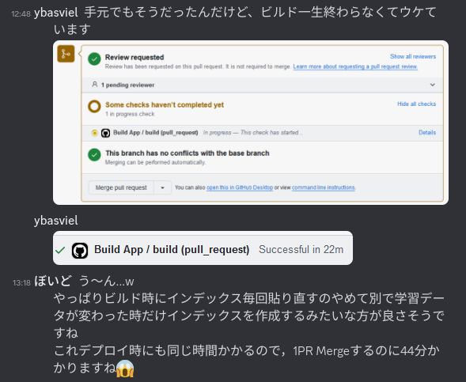
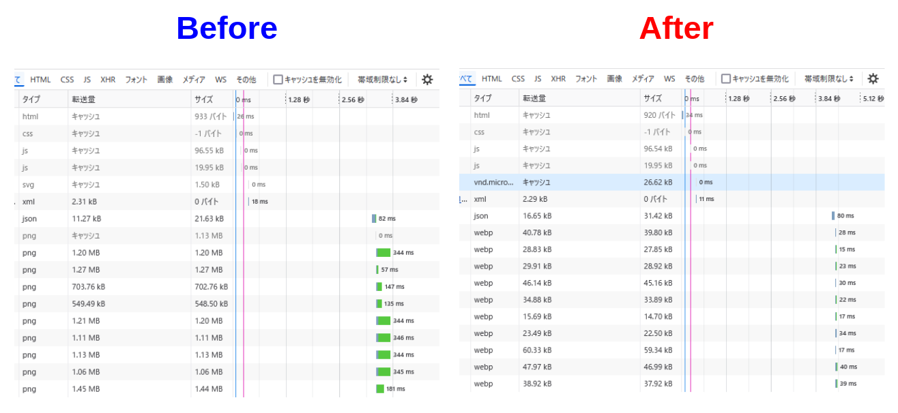

# 工研部報の検索システムを作ってみた
## どんなものを作ったのか

こっちの記事とかを見てください

- [/works/KokenReportViewer](/works/KokenReportViewer)
- <https://report-viewer.ueckoken.club/>

## 各技術スタックとか
### フロントエンド

Vue+Vite+TSで実装しています。CSSはTailwindcssを利用しました。バイトの経験からこの組み合わせしか使っていないのですが、Svelteとか使ってみたいですね。次なにか開発するときは使ってみたい。「何を使うか」よりも「何をつくるか」をベースに考えて生きているので、新しい技術要素の習得になかなか進めていないのは反省です。


### バックエンド

Python+FastAPIで実装しています。

全体の流れとしては、OCRした文章をページ単位でSentenceTransformerでベクトル化し、同じくベクトル化した検索クエリで近傍探索して検索を行っています。

ここでOCR、というかOCRもどきなのですが、これにはマルチモーダルなLLMであるところのChat GPT-4oを用いています。手書きの文章など汚いデータ構造のものが多く、通常のOCRアプローチではろくに文章が読みとれず苦戦していましたが、Chat GPTに「文字起こしして」と頼んだらそこそこ読み取ってくれました。そもそもインデックスを貼るだけであれば「なんとなくページの内容が読み取れれば良い」し、ベクトル化と近傍探索を用いたあいまい検索でカバーできるので、全体で見るとちゃんと機能しているかと思います。

埋め込みモデルには<https://huggingface.co/pkshatech/GLuCoSE-base-ja-v2>を用いました。日本語の埋め込みモデルとしては結構いい感じらしいです。(よく分かってない顔)

近傍探索には[Annoy](https://github.com/spotify/annoy)を利用しました。特筆すべきことは特にないかな。非常に簡単に利用できるのでおすすめです。

と、偉そうに語っていますが、Semantic Searchの部分はcohereのチュートリアルのほぼパクリです。

<https://docs.cohere.com/v2/page/basic-semantic-search>

## いろいろあった部分
### コンテナ上でSentenceTransformerを使うと計算結果がずれる

これはDockerコンテナが原因なのか、他の環境の差異が問題なのかちゃんと確認していないのですが、どうやらSentenceTransfomerはちゃんと条件揃えないと計算結果が変化してしまうものらしい。

<blockquote class="reddit-embed-bq" style="height:316px" data-embed-height="316"><a href="https://www.reddit.com/r/pytorch/comments/z9amf3/sentencetransformer_producing_different_sentence/">SentenceTransformer producing different sentence embedding results in Docker</a><br> by<a href="https://www.reddit.com/user/danielwoi/">u/danielwoi</a> in<a href="https://www.reddit.com/r/pytorch/">pytorch</a></blockquote><script async="" src="https://embed.reddit.com/widgets.js" charset="UTF-8"></script>

ちゃんと原因を調べるべきなのですが、とりあえずデプロイ時にコンテナ上でインデックスを貼り直すようにすることで解決を図りました。


### ビルドが重い

というわけでコンテナ上で埋め込みの計算を行うことで解決を図ったわけですが、ここで新たな問題が浮上しました。データセット等に変更のないビルドの際も埋め込みの計算が走るため、いちいちビルドに20分もかかってしまう事態に陥りました。ビルドテストとデプロイで40分超えです。



困りましたね。(未解決問題)

一応こんな方針で解決を図ろうとしてはおります。

> プロジェクトの数が増えてくると、一部しか変更していないのにすべてのCIを実行するのは、リソースを消費して、時間もかかるために避けたいです。以下のようにGithub Actionsでは特定のパスに変更があったときだけワークフローをトリガーする機能があります。
> [Poetryを使ったPythonのモノレポ構成｜川尻亮真 (Ryoma Kawajiri)](https://zenn.dev/tellernovel_inc/articles/27e21b8cca94c8)

### 画像のロードが重い

最初はローカルで動く程度にテキトーに作っていたため、わりと解像度の高いpng画像を表示させていたのですが、当然かなりロード時間がかかって他人に見せられる代物ではなかったので対策を講じた。

まずオリジナル画像はwebpに非可逆性で変換する。
```shell
convert hoge.png -quality 100 -define webp:lossless=false hoge.webp
```

次に10%で変換してサムネイルを生成。
```shell
convert hoge.png -quality 10 -define webp:lossless=false hoge.webp
```

before/afterです。おおむね1/10くらいの読み込み時間になって4G回線でもサクサク表示されるようになりました。



そういえばこのサイトも画像の表示が重いのでなんとかしたいですね。

## 今後の課題 (2025-01-24)

- 上記の通りビルドを軽くしたい
- UIのデザインをかなり雑にやってしまったので、いい感じの見た目にしたい。直近だとビューワのボタンとかをかっこいいSVGにしてあげたいですね
- ビューワ表示のとき、ページ切替がスムーズに行くように前後数ページを予め読み込んでおくような機能がほしい
- ホーム画面に表紙の一覧表示がほしい。せっかくビューワを作ったので、検索しなくても見れるようにしたいよね
- まだスキャンしてないデータも多く残っているので、データを追加したい


## 謝辞

インフラ周りは全く分からなかったので、ぼいどさん(<https://www.k1h.dev/>)に協力を仰ぎ、分担してなんとか実装にこぎつけました。大変感謝しております。githubとdiscordで連絡を取り合って開発が進められて大変楽しかったです。

最近メンタルの不調が続いていたのですが、久しぶりにコードを書いたら元気になりました。