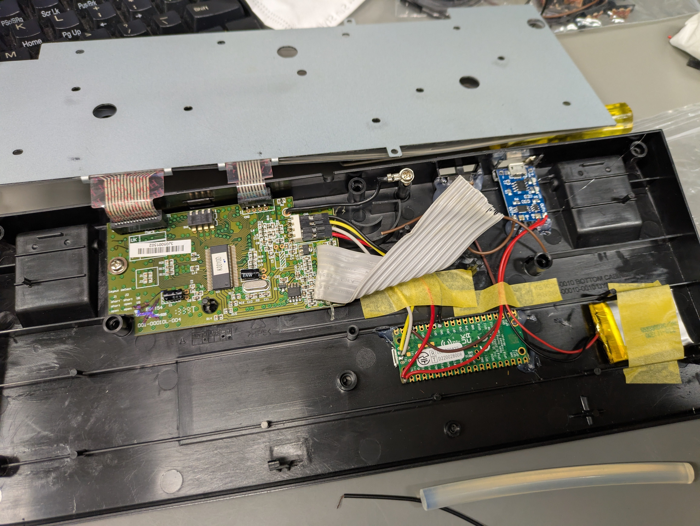

# HHKB Lite2 BLE化
## 概要

HHKB Lite2にRaspberry Pi Pico Wとリポバッテリーを載せて無線化した話です。研究室のデスク周りをスッキリさせたくて作りました。ファームウェアは借り物ですし、そんなに大したことはせず簡単にできました。

## ファームウェア

自作キーボードの文脈でUSB接続のキーボードをBluetooth化しようという試みはいくつかあるようで、今回は以下のものを利用しました。

- @BParound30, Pico WのBluetoothでキーボードを手軽に無線化 #RaspberryPi - Qiita, <https://qiita.com/BParound30/items/8261d6fef2fe6825a8f8>, (2025-03-24参照)
- taichan1113/picow_ble_hid_keyboard, <https://github.com/taichan1113/picow_ble_hid_keyboard>, (2025-03-24参照) 

この方のgithubリポジトリにコンパイル済みのファームウェア(uf2ファイル)も公開されていたので楽ちんで助かりました。

## ハードウェア

中を開けるとUSBダウンストリームポートの空間が利用できそうだったので、これを引っ剥がしてリポの充放電モジュールと電源スイッチを配置しました。残りのバッテリーとRaspberry Pi Pico Wは他の隙間に埋まりそうだったので適当に配置、グルーガンで貼り付けました。リポは部屋に落ちていたものを雑につけたのですが、どのくらい保つかわかりません。400mAhのものでした。

Raspberry Pi Picoのボードの裏側にはUSBの信号線のパッドがついています。先程のQiita記事の方はUSBで接続していましたが、私はキーボード内に組み込みたかったのでここに配線しました。

> - TP2: USB DM
> - TP3: USB DP
>
> Raspberry Pi Pico Datasheet, <https://datasheets.raspberrypi.com/pico/pico-datasheet.pdf>, (2025-03-24参照)

ちなみにこの画像の後そのまま閉じたら金属の天板がどこかにショートしたようで、うまく動作しませんでした。危うくリポを燃やすところでした…こわいね…。適当なテープとか貼って絶縁しておきました。

## おまけ

なぜか私のPC環境(manjaro)では接続がうまくいかなかったのですが、こちらのお作法に沿ってペアリングしたらうまく行きました。BLEデバイス共通の問題なんでしょうか。

[https://wiki.archlinux.jp/index.php/Bluetooth_
マウス#Logitech BLE マウス (M557、M590、anywhere mouse 2 など) の問題](https://wiki.archlinux.jp/index.php/Bluetooth_%E3%83%9E%E3%82%A6%E3%82%B9#Logitech_BLE_.E3.83.9E.E3.82.A6.E3.82.B9_.28M557.E3.80.81M590.E3.80.81anywhere_mouse_2_.E3.81.AA.E3.81.A9.29_.E3.81.AE.E5.95.8F.E9.A1.8C)

