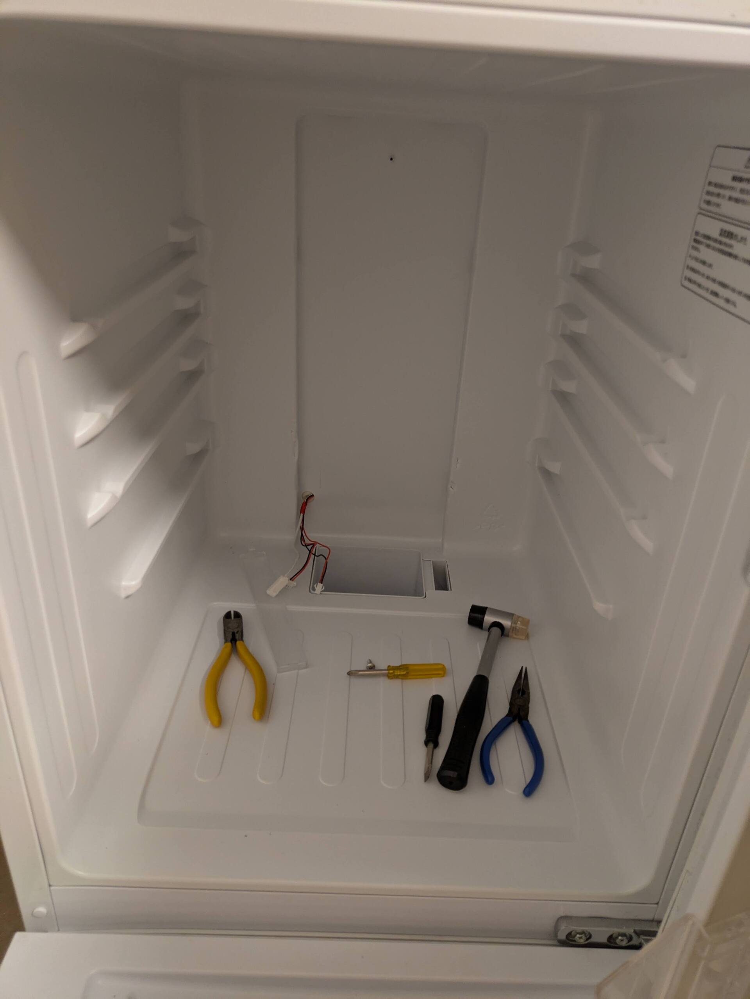

# 冷蔵室だけ冷えなくなった冷蔵庫を直した
## 症状

ある日突然冷蔵室が冷えなくなって廃棄を検討していたんですけど、冷凍庫は冷えていたんですよね。どうやらコンプレッサーは無事っぽい。通常、コンプレッサーは冷凍室のみを冷やしていて、冷蔵室は冷凍室の冷気を送風することで冷やしているらしい。言われてみると数ヶ月前からなにかゴロゴロと異音がなっていたのでファンの故障が原因かもしれない。とすると自分でも直せそうでは？ということであがいてみました。

機種はHisense HR-G13A-Wです。伝説の先輩から譲り受けた冷蔵庫なので寿命だとは思いますが、私の引っ越しまではなんとか耐えてほしいです。

## 制御基板を見てみる

そもそも冷蔵庫ってどこからバラしたらいいのか分かんないですよね。とりあえず目につくところにネジがついている黒い箱が裏についてたので開けてみました。

結論からいうとここは開ける必要なかったのですが、電解コンデンサが爆発してるとかではなかったことを確認できたのでまあヨシ！FAN+-ってシルクがあったのでテスタで電圧が来ていることを確認、10vくらい来てたかな…定格12vってとこでしょうか。

## ファンを探る

冷蔵庫内ってのっぺりしてて一見外せそうな部分がないですよね。とはいえ冷蔵庫の裏側は断熱材で固められているっぽいので内側しかなさそう。

そういえば基板の方のコネクタはLEDとまとめられていたからLED周辺だろうか…と探ってみるとネジを発見

写真を撮り忘れたのですが、カバーに爪がついているので少しずつマイナスドライバーを挟んでぐいぐいやったら外れました。

92x92mm 12V 0.09Aのファンを発見しました。12Vかけてみるとゴロゴロ鳴っていて、10Vくらいにすると止まってしまいました。ベアリングか軸が壊れているっぽい？PCファンって結構消費電流の大きいものが多くて、案外ちょうどいい交換用のファンを探すのに苦労しました。0.4Aとか流して電源側が壊れると嫌ですからね…

## 直った

しばらくしたらちゃんと冷えてきました。やったね！

