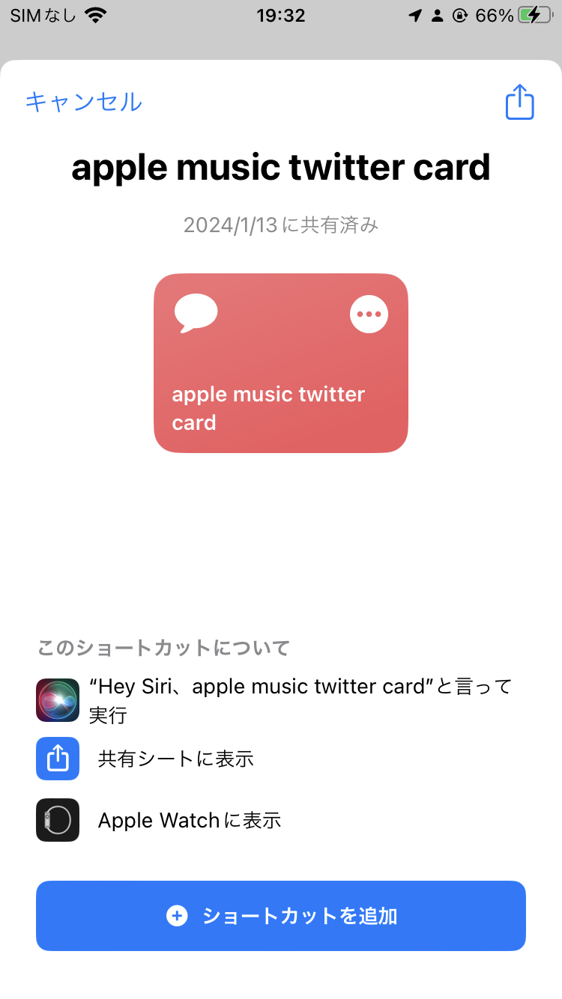
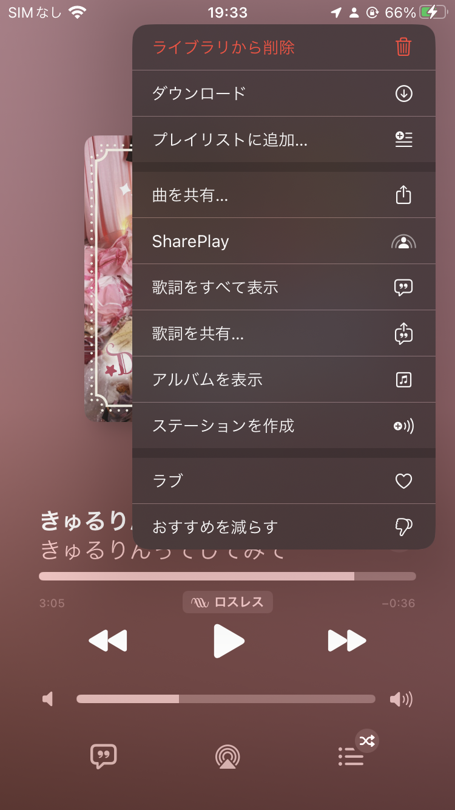
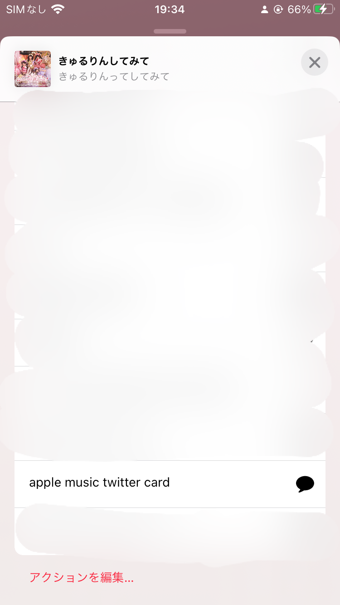
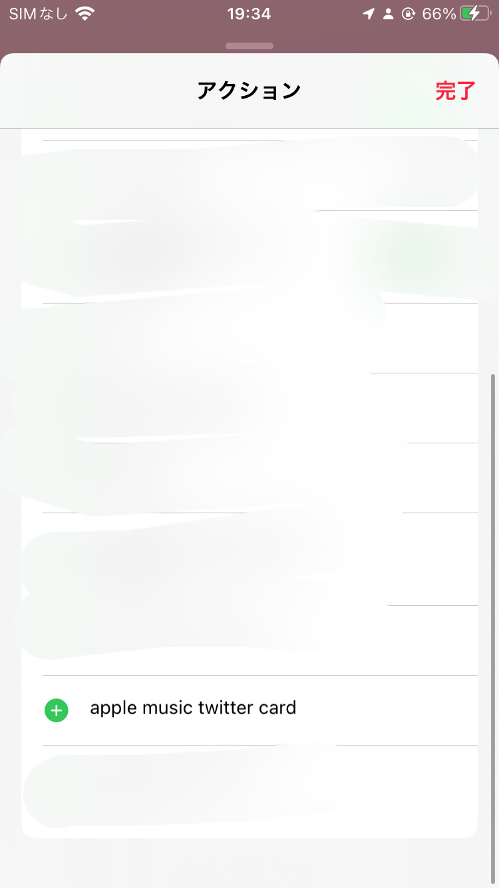
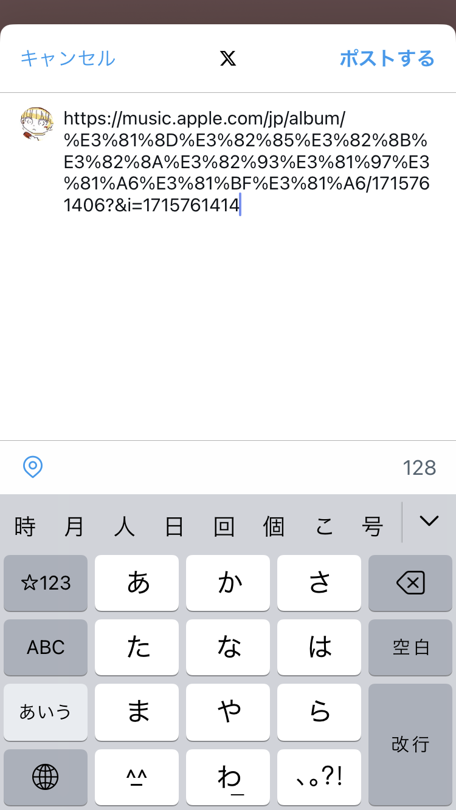

# Apple Music Thumbnail Tweet Shortcut
<!--description
Apple Musicのリンクをツイートするときにサムネイルを表示させるようにするiosのショートカット
description-->

## 概要

2024年1月13日現在、applke musicアプリから聞いている曲のURLをツイートするとtwitter cardが表示されない不具合が発生している。対策として、ツイートする前に以下のようにURLを変更すると良いようなので、これをiosのショートカットにした。(そのうち治ると思うけど…)

> 変更前:
> 
> https://music.apple.com/jp/album/shadow-and-truth/1504629616?i=1504629617
>
> 
> 変更後:
> 
> https://music.apple.com/jp/album/shadow-and-truth/1504629616?&i=1504629617

追加はこちら: 
<https://www.icloud.com/shortcuts/544a9993e51248fb95665174f3e6e5aa>

## 使いかた

1. 上記のURLに飛ぶと次のような画面が出ると思われるので、「ショートカットを追加」をタップ

2. Apple Musicアプリから、「曲を共有」をタップ

3. 下の方にショートカットの項目が追加されている。このままでも使えるが、上の方に配置したい場合は最下部の「アクションを編集」をタップ

4. 「apple music twitter card」をタップ

5. 上の方に固定される

6. 「apple music twitter card」をタップすると以下のようにツイート画面になる
