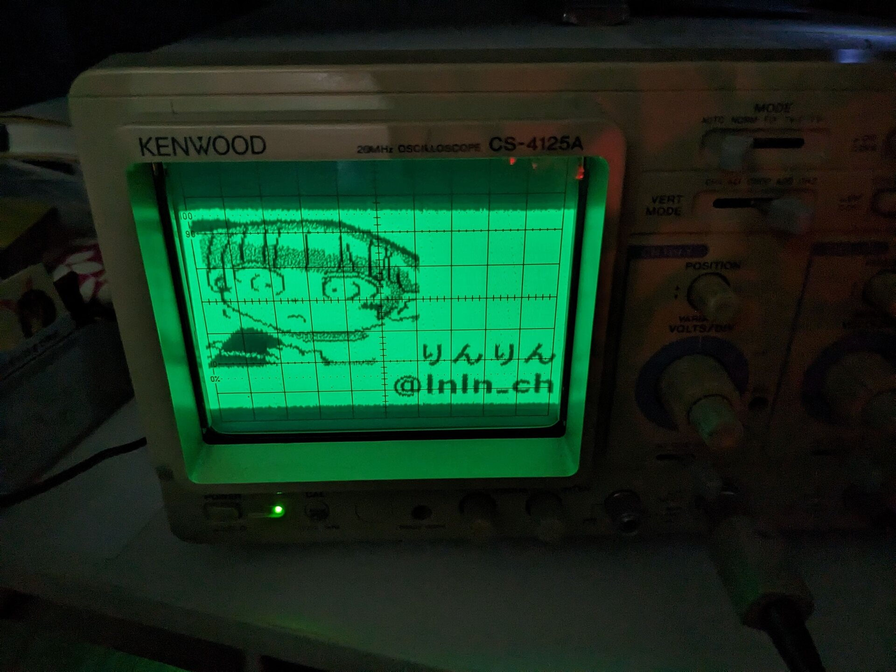
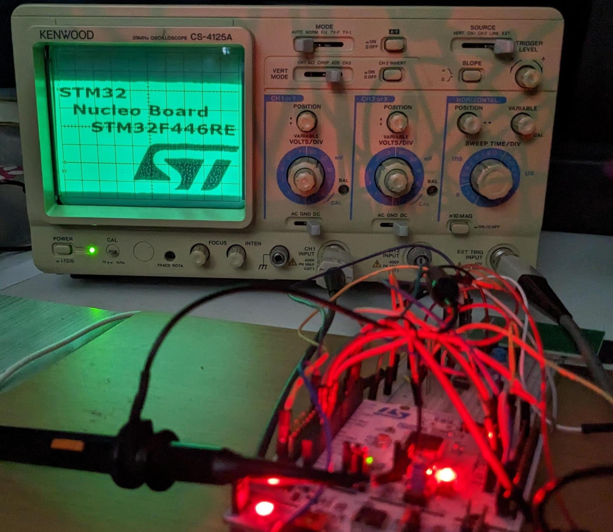

# オシロスコープお絵描き
<!--description
アナログのオシロスコープに画像を表示する
description-->

## 概要

マイコンからいい感じに信号を吐き出しアナログのオシロスコープに画像を表示するデバイス。

はじめはSTM32で開発を行ったが、RaspberryPi Picoが流行り始めたため、後にそちらに移植した。
RaspberryPi Picoによる実装のお話は[技術書典マーケットで販売中の工研部報73号](https://techbookfest.org/product/q7XJb2sjQsriHWmTX0H608?productVariantID=297YcxvDr9rp008nVB8Ghy)に掲載した。

古くなった号から無料公開しているそうなので、そのうち[こちらの工学研究部HP](https://www.koken.club.uec.ac.jp/docs.html)に掲載されるだろう。

