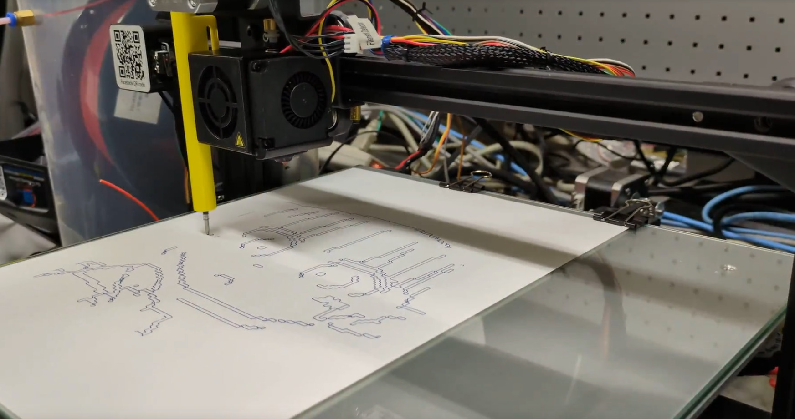
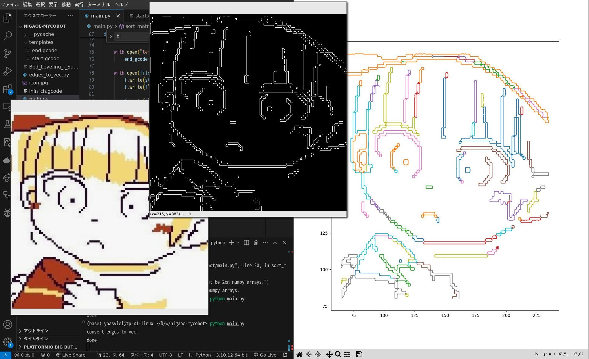
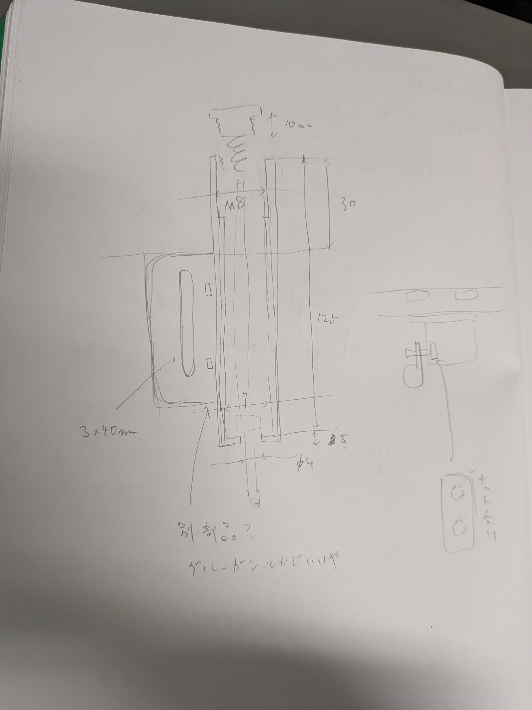
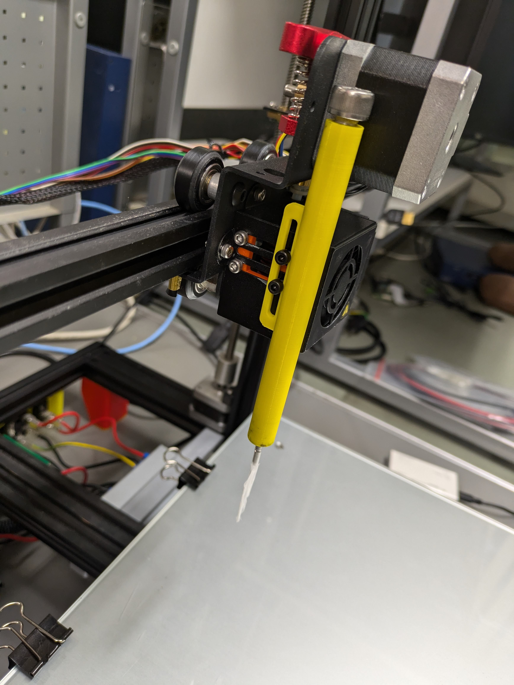

# ImagePlotter
<!--description
画像をベクトル線画に変換してお絵描きができるペンプロッタ
description-->



## 概要

<https://github.com/ybasviel/ImagePlotter>

入力画像のエッジを検出後、検出されたエッジをベクトル化し、ペンを取り付けた3Dプリンタを用いてお絵描きをした。


## エッジ検出とベクトル化



エッジ検出はよくあるやつ。(ガウシアンぼかしはいらないかも。ガウシアンぼかしやめてモルフォロジー変換を入れたいかも)
```python
def get_edges(image):
    gray = cv2.cvtColor(image, cv2.COLOR_BGR2GRAY)
    gray = cv2.GaussianBlur(gray, (5, 5), 0)
    edges = cv2.Canny(gray, 70, 100)
```

検出したエッジのベクトル化は[@s-col(スコル) python+OpenCVで検出した画像のエッジを曲線(折れ線)に変換する[Python3] #画像処理 - Qiita](https://qiita.com/s-col/items/115b7f7d80133f89359d)を利用した。上記の実装ではnp.ndarrayのリストのリストが返ってくる実装になっていて、少々使いにくかったため、Nx2のnp.ndarrayのリストが返るように変更した。


## gcode化

前段で座標のリストが得られたので、3Dプリンタのベッドサイズに収まるように座標変換しつつ、`G1 X200, Y150`といった感じで指定していく。

```python
def dump_to_gcode_str(polylines):
    moving_z = 50
    writing_z = 40
    
    with open("templates/start.gcode", "r") as f:
        start_gcode = f.read()

    with open("templates/end.gcode", "r") as f:
        end_gcode = f.read()

    gcode = ""
    gcode += start_gcode
    gcode += f"E0;\n"

    gcode += f"G1 Z{moving_z} F240\n"

    for polyline in polylines:
        if np.shape(polyline)[0] > polyline_noise_threshold:
            gcode += "G1 F7200\n"
            gcode += f"G1 X{polyline[0][0]} Y{polyline[0][1]} Z{moving_z};\n"
            gcode += f"G1 Z{writing_z} F2400;\n"
            for coord in polyline:    
                gcode += f"G1 X{coord[0]} Y{coord[1]};\n"
            gcode += f"G1 X{polyline[-1][0]} Y{polyline[-1][1]} Z{moving_z};\n"

    gcode += f"G1 Z{moving_z} F240;\n"

    gcode += end_gcode

    return gcode
```

## シリアル転送

ファイルに書き込んでSDカードやらで印刷しても良いのだが、スムーズにデモをしたかったのでシリアルで転送するようにした。

[ShyBoy233/PyGcodeSender: A simple python script to send gcode file using serial to various machines.](https://github.com/ShyBoy233/PyGcodeSender/tree/main)を丸パクリしたが、はじめのシェイクアップ？が遅かったのでディレイを増やしておいた。

```python
def send_gcode_by_serial(ser, codes):
    codes = codes.split("\n")

    ser.write(b"\r\n\r\n") # Wake up microcontroller
    time.sleep(3) # ここを3秒にした。1秒だと早すぎて1つめのコマンドを読んでくれなかった
    ser.reset_input_buffer()

    tqdm4codes = tqdm.tqdm(codes, bar_format='{l_bar}{bar:10}{r_bar}{bar:-10b}', unit=" codes", ncols=130)
    for code in tqdm4codes:
        tqdm4codes.set_postfix(gcode=code) # Show gcode at postfix
        if code.strip().startswith(';') or code.isspace() or len(code) <=0:
            continue
        else:
            ser.write((code+'\n').encode())
            while(1): # Wait untile the former gcode has been completed.

                if ser.readline().startswith(b'ok'):
                    break
```

## ペンホルダー

ペンが紙にいい感じに当たるように、バネで紙面に押し付けるようなホルダーを作成した。結構無理してもBambuLabがなんとか印刷してくれるので、印刷のしやすさを考慮せず適当にモデリングした。こんな円柱を縦向きに印刷できちゃうのだからすごいことである。冷静に考えたら、円柱部分を三角柱に変えて横置きで印刷し、ネジ部はタップを切るべきだろうと思う。





