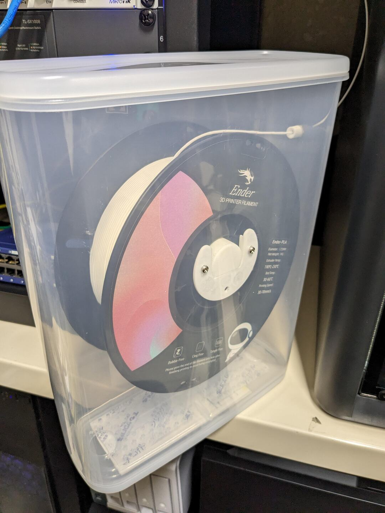
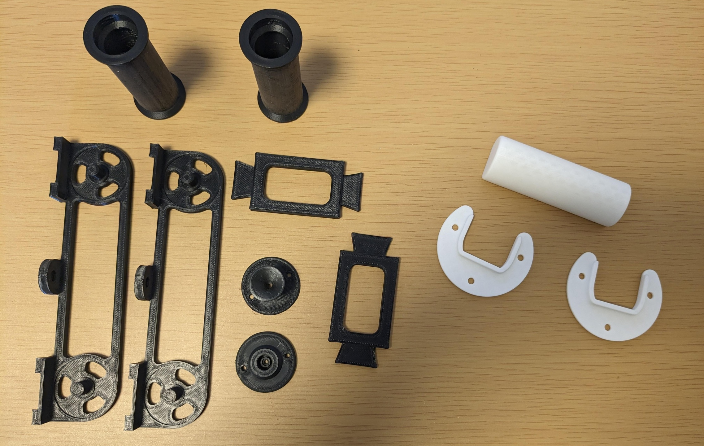
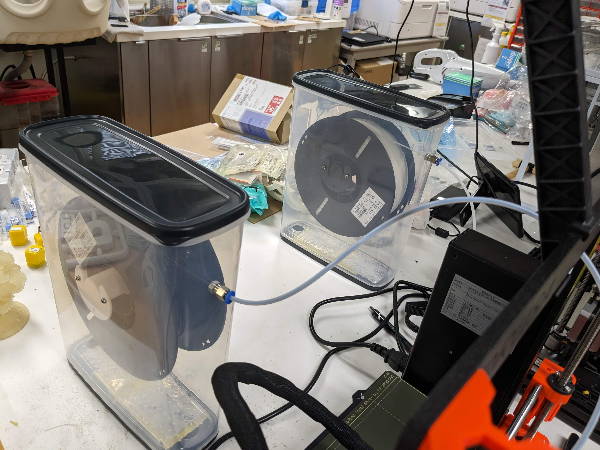

# Low Cost Filament Box
<!--description
1000円程度で作成できる安価なフィラメント防湿箱
description-->

1000円程度で作成できる安価なフィラメントの防湿箱をつくった。
モデルの利用はこちらのURLから。

- Thingiverse: <https://www.thingiverse.com/thing:6167875>
- Printables: <https://www.printables.com/model/848514-low-cost-filament-dry-box>

以前はよくある有名なダイソーの5.5L密閉容器を用いたものを作成し利用していたが、次のような不満があった。

- 制作にベアリングが必要
- 部品点数が多い
- ダイソー 5.5L密閉容器の入手性が悪い

最後の項目は致命的だ。ダイソー 5.5L密閉容器はダイソーの店舗か、あるいはオンラインストアでしか入手できない。店舗によって置いていなかったりするため、ダイソーの店舗を廻ったりするのも苦労であるし、オンラインストアも最低購入金額が設定されているため面倒だ。特に大学の施設で運用する際、校費を利用して購入するハードルが高かった。そこで、Amazonや校費での支払いが容易なモノタロウでもすべての部品が手に入るような防湿箱を作成した。

用いた箱はイノマタ化学の乾物ストッカー 6.0、amazonやモノタロウで入手可能だ。その他、ベアリングは使用せず継手とテフロンチューブがあれば作成できる。画像にある通り、印刷物も以前用いていたものから大幅に削減できた。

- イノマタ化学の乾物ストッカー 6.0 <https://amzn.asia/d/5ei95pD> or <https://www.monotaro.com/p/7418/1635/>
- テフロンチューブ 外径4mm 内径2mm <https://www.monotaro.com/p/3760/8636/> 
- PC4-M6 継手 <https://www.monotaro.com/p/5288/4038/> 
- M3x6mm ボルト ナット

