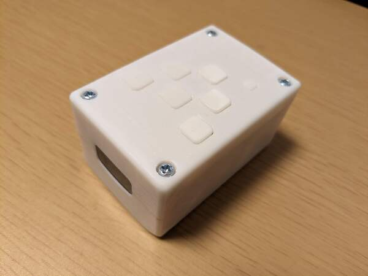
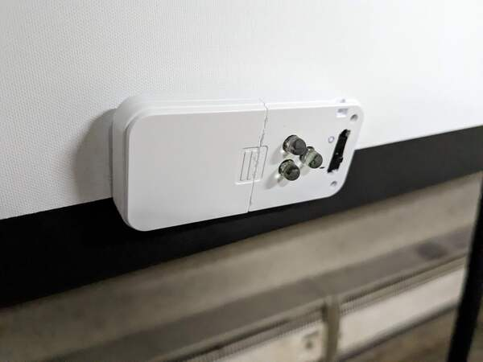
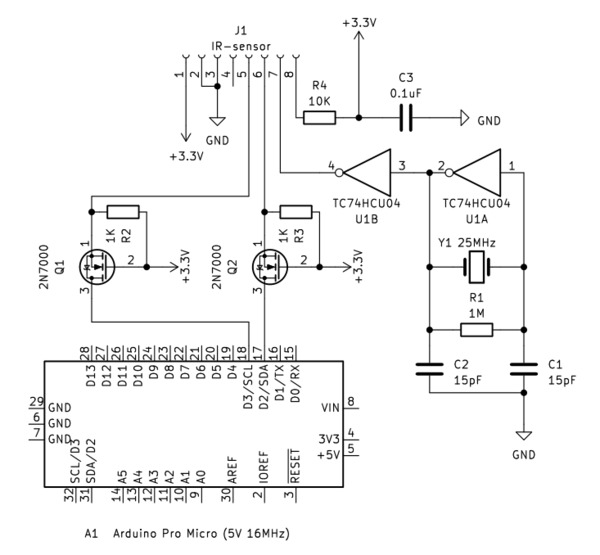

# WiimoteIR-HIDmouse

<!--description
WiiリモコンのIRセンサを利用したマウス。Wiiリモコンのように画面に向けてマウスを操作できる。
description-->

## 概要
<figure><a href="003.jpg"></a><figcaption>本体</figcaption></figure>

WiiリモコンのIRセンサを利用したマウス。Wiiリモコンのように画面に向けてマウスを操作できる。HIDデバイスなので、どのコンピュータでもUSBで接続するだけですぐに利用できる。ケースは光造形3Dプリンタで作成した。


## 利用している様子

<blockquote class="twitter-tweet">
<p lang="ja" dir="ltr">wiiリモコンみたいなマウス、完成しました <a href="https://t.co/yuGPl4Wm0K">pic.twitter.com/yuGPl4Wm0K</a>
&mdash; りんりん (@lnln_ch) <a href="https://twitter.com/lnln_ch/status/1626096029157453824?ref_src=twsrc%5Etfw">February
  16, 2023</a>
</blockquote>
<script async src="https://platform.twitter.com/widgets.js" charset="utf-8"></script>

## Wiiリモコンのしくみ


Wiiリモコンが動作するためにはセンサーバーが必要である。このセンサーバーは、名前とは反して、センサーはついていない。センサーバーには赤外線のLEDがついており、Wiiリモコンはその光をカメラで見ることで、リモコンの向いている方向を調べている。


今回のマウスも同様に、センサーバーの代わりとなる赤外線発光部が必要になる。センサーバーは両端にLEDがついており、2点を捉えることでカーソルの角度や距離が取得できるが、マウスカーソルはWiiと異なりそれらは必要ないため、赤外線発光部は1点のみにし、つぎのようなコンパクトな作りにした。明るさ確保のためLEDを3つ付けたが、センサに捉えられるのは1点だ。利用したのはタカチのボタン電池ボックスつきのケースである。(<a target="_blank" href="https://www.takachi-el.co.jp/products/CS">https://www.takachi-el.co.jp/products/CS</a>)


<figure><a href="002.jpg"></a><figcaption>赤外線発光部(Wiiのセンサーバーにあたる)</figcaption></figure>


## WiiリモコンのIRセンサをマイコンで利用する
<figure><a href="circ1.png"></a><figcaption>回路図</figcaption></figure>

WiiモーションplusがないモデルのWiiリモコンのセンサはI2Cで利用できる。今回はこれをArduino Pro Microに接続した。センサの利用方法について、詳しくはkako氏のサイトが参考になる。(<a target="_blank" href="http://www.kako.com/neta/2007-001/2007-001.html">http://www.kako.com/neta/2007-001/2007-001.html</a>)


ArduinoおよびESP32向けにしょっぱいライブラリを作ったので公開する。<a target="_blank" href="https://github.com/ybasviel/wiiIRcam">https://github.com/ybasviel/wiiIRcam</a>


```cpp
#include <wiiIRcam.h>
#define SENSITIVITY 2

wiiIRcam cam;

void setup(){
  Serial.begin(115200);
  cam.begin(SENSITIVITY); // You can omit SENSITIVITY
}

void loop(){
  char str[128];

  if( cam.get() ){
    sprintf(str, "%d,%d,%d,%d,%d,%d,%d,%d\n", cam.x1, cam.y1, cam.x2, cam.y2, cam.x3, cam.y3, cam.x4, cam.y4);
    Serial.print(str);
  }
}
```
