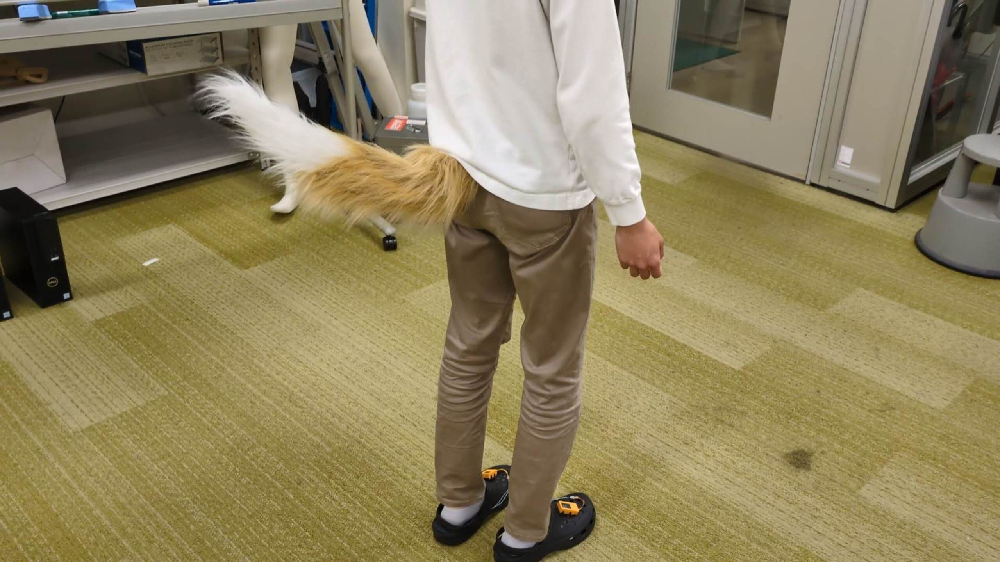
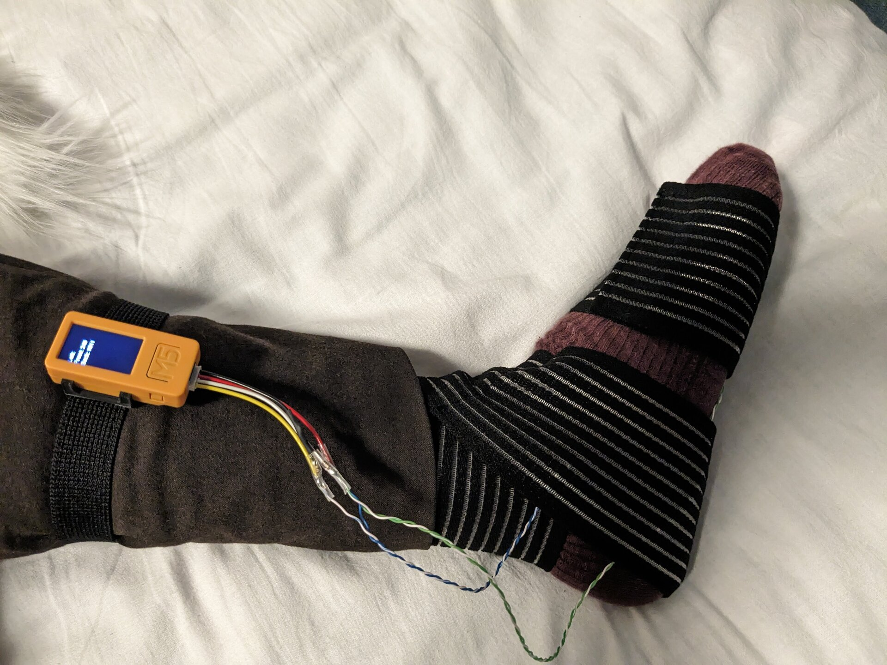
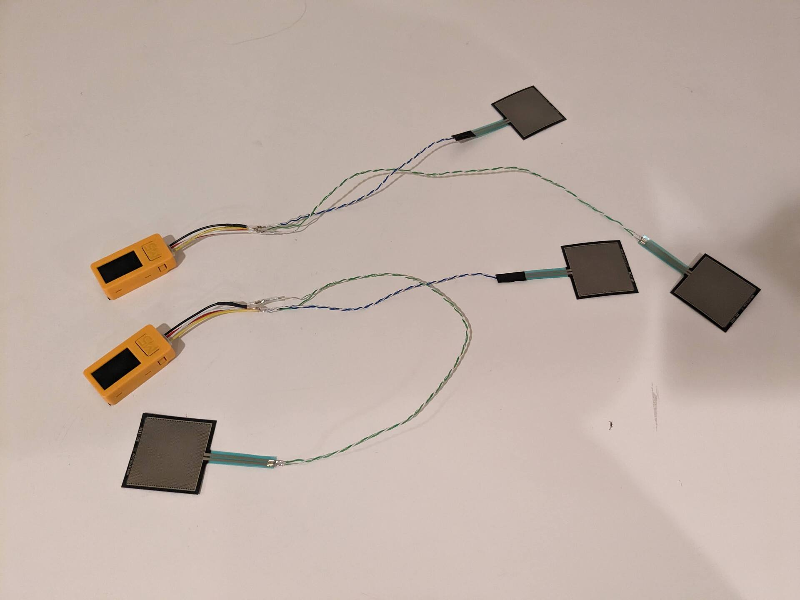

# うごくしっぽ
<!--description
しっぽが動いたらかわいいなと思って作った
description-->

しっぽが動いたらかわいいだろうと思い作った。足裏に装着した圧力センサによって体重移動や足の動きを取得ししっぽをコントロールする。

センサ側はM5Stickc、しっぽ本体はESP32によって動作している。ESP32側でWiFiのアクセスポイントを開き、そのWiFiに接続したM5StickからセンサデータをUDPで送信している。

## しっぽが動く様子

<iframe width="100%" height="450" src="https://www.youtube.com/embed/6IAS9O0VAWA?si=iAGXkW9IFKYLFn09" title="YouTube video player" frameborder="0" allow="accelerometer; autoplay; clipboard-write; encrypted-media; gyroscope; picture-in-picture; web-share" referrerpolicy="strict-origin-when-cross-origin" allowfullscreen></iframe>