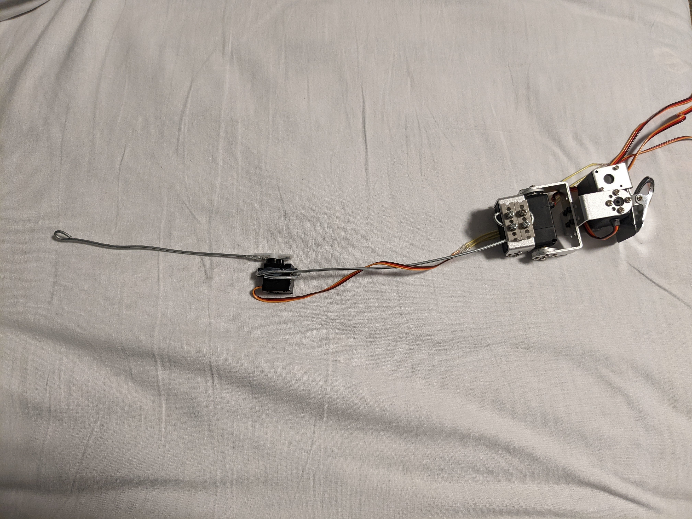
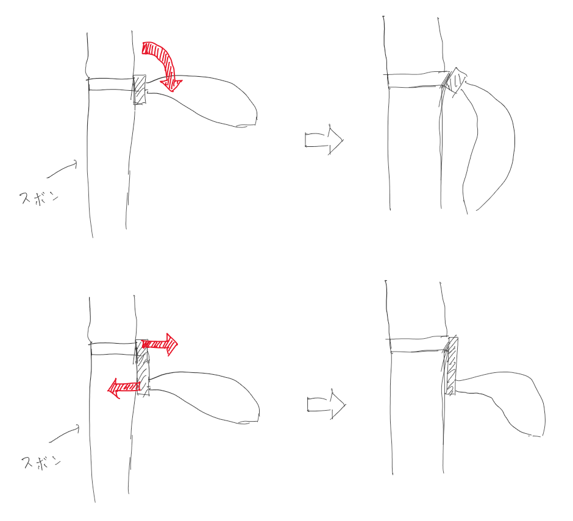
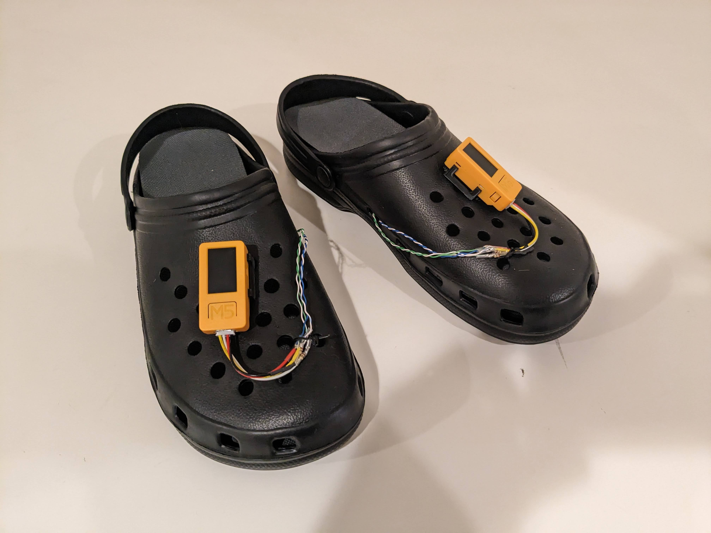

# うごくしっぽ
<!--description
しっぽが動いたらかわいいなと思って作った
description-->

## 概要

しっぽが生えていたらかわいいだろうと思い作った。

モバイルバッテリーで動作し、人の動きに合わせて実際に生えているかのように動く。ズボンのベルトにクリップで挟むだけで容易に着脱が可能である。

## Ver.1.0

アマゾンで買ったコスプレ用のしっぽから綿を抜き、中にサーボモータを入れた。マイコンにはATmega328を利用し、このモデルでは単調な周期運動しかできない。図2に示すのは当時のしっぽ内部の様子である。

しっぽはクリップを用いてズボンのベルトに装着するため、非常にかんたんにつけ外しが可能であるが、この取り付け部に関しては少々苦戦した。図2に示すような最初期のプロトタイプでは関節部の直近にクリップを取り付けた。しかし図3に示すとおり、このプロトタイプではベルトに大きな曲げモーメントがかかり、しっぽが下を向いてしまう。そこで取り付け部を尻尾の付け根より上方にずらした。これによりベルトにかかる曲げモーメントが2つの力に分割され、しっぽの重量を支えられるようになった。

## Ver.1.1

Ver.1.10では単調な動きしかできなかったが、操作を行うためのセンサを追加した。当初は筋電センサを導入しようと考えていたが、筋電センサはコストが高く、装着の手間もあるため、なかなか手を出せずにいた。ところが急遽、とあるイベントに間に合わせる必要が出てきたため、その場しのぎで手元にあった曲げセンサを用いたコントローラを作成した。

## Ver.2.0

人間の関節に曲げセンサを取り付けようとすると皮膚の引張にうまく追従できず、なかなか着脱が容易でないことが分かった。そこで足裏に圧力センサを装着することにした。足にかかる荷重によって体重移動や足の動きを取得し、しっぽをコントロールする形に変更した。足の荷重を利用することでハンズフリーかつ、自然な操作が可能になった。装着部は百均で購入したサポーターを使用した。

センサ側はM5Stickc、しっぽ本体はESP32によって動作している。ESP32側でWiFiのアクセスポイントを開き、そのWiFiに接続したM5StickからセンサデータをUDPで送信している。

## Ver.2.1

サポータを用いて足に装着するのは依然として面倒であったので、足に固定していたセンサを靴の中敷きに固定する形に変更した。これによって着脱が容易になり、初めての人間でも容易に獣人化できるようになった。

## しっぽが動く様子

<iframe class="w-full aspect-video" src="https://www.youtube.com/embed/Oip15NJZhbU?si=fIN0SUB_rcyNRS48" title="YouTube video player" frameborder="0" allow="accelerometer; autoplay; clipboard-write; encrypted-media; gyroscope; picture-in-picture; web-share" referrerpolicy="strict-origin-when-cross-origin" allowfullscreen></iframe>
