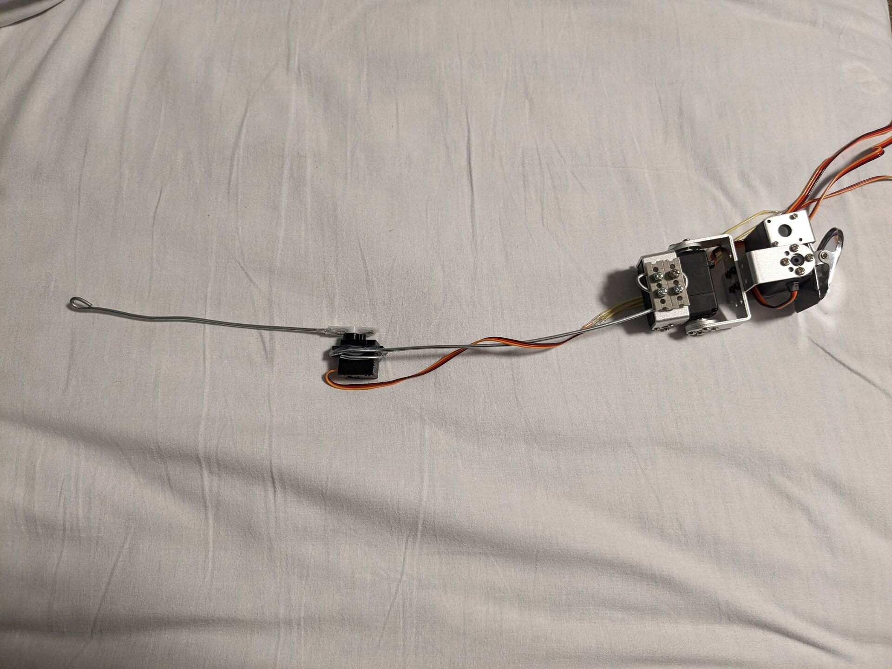

# うごくしっぽ
<!--description
しっぽが動いたらかわいいなと思って作った
description-->

しっぽが生えていたらかわいいだろうと思い作った。

## Ver.1.0

アマゾンで買ったコスプレ用のしっぽから綿を抜き、中にサーボモータを入れた。マイコンにはATmega328を利用し、動きは周期的に動かすのみである。図2に示すのは当時のしっぽ内部の様子である。

## Ver.1.1

当初は筋電センサを導入しようと考えていたが、筋電センサはコストが高く、装着の手間もあるため、曲げセンサを用いたコントローラを作成した。

## Ver.2.0

足裏に装着した圧力センサによって体重移動や足の動きを取得し、しっぽをコントロールする形に変更した。足の荷重を利用することでハンズフリーかつ、自然な操作が可能になった。装着部は百均で購入したサポーターを使用した。

センサ側はM5Stickc、しっぽ本体はESP32によって動作している。ESP32側でWiFiのアクセスポイントを開き、そのWiFiに接続したM5StickからセンサデータをUDPで送信している。

## Ver.2.1

足に固定していたセンサを靴の中敷きに固定する形に変更した。これによって着脱が容易になり、初めての人間でも容易に獣人化できる。

## しっぽが動く様子

<iframe width="100%" height="450" src="https://www.youtube.com/embed/6IAS9O0VAWA?si=iAGXkW9IFKYLFn09" title="YouTube video player" frameborder="0" allow="accelerometer; autoplay; clipboard-write; encrypted-media; gyroscope; picture-in-picture; web-share" referrerpolicy="strict-origin-when-cross-origin" allowfullscreen></iframe>