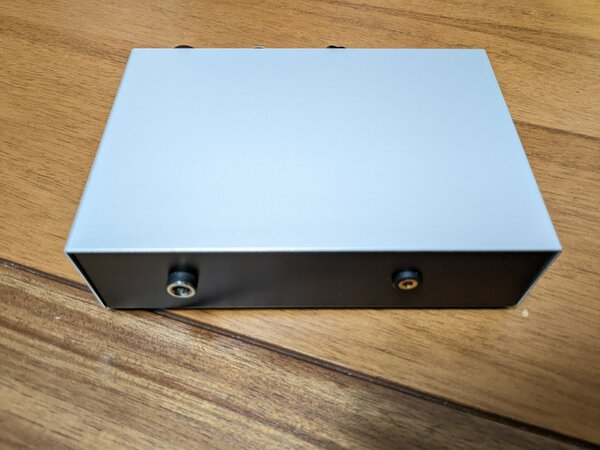
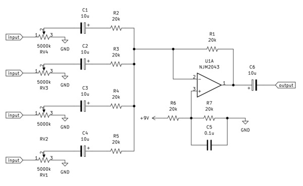
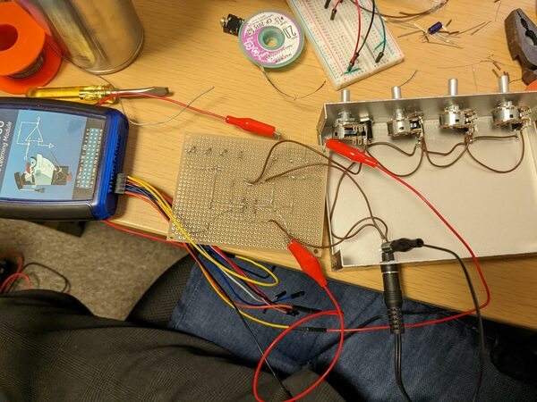
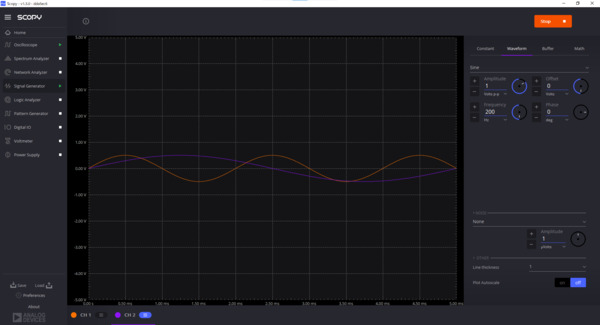
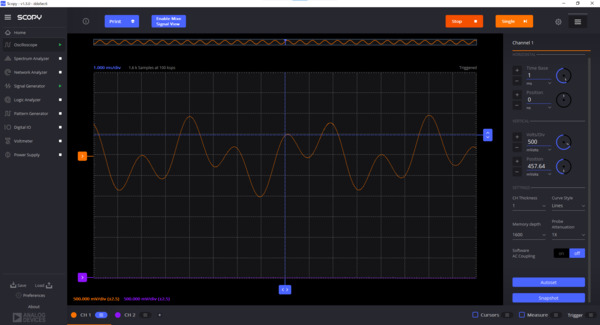

# オーディオミキサー

<!--description
人に頼まれて作った。自分も欲しいかも
description-->

<figure>
  
  
  <figcaption>外観</figcaption>
</figure>

人に頼まれたので作った。オペアンプの加算回路らしい。前面に3.5mmイヤホンジャックの入力4つとボリューム、背面に出力と電源をつけた。イヤホンジャック入力のサウンドバーに接続するので、増幅はしていない。回路はググったものをパクった。
<figure>
  
  <figcaption>回路図 (左右片側)</figcaption>
</figure>
<figure>
  
  <figcaption>制作風景</figcaption>
</figure>
<figure>
  
  
  <figcaption>ADALM2000を使ってテストしてみた様子。入力2波形の合成波っぽいのがたぶん出ていて楽しい。</figcaption>
</figure>

