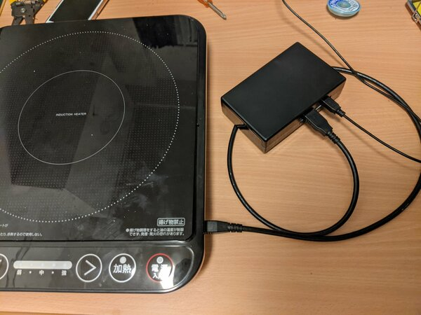
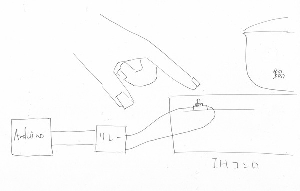
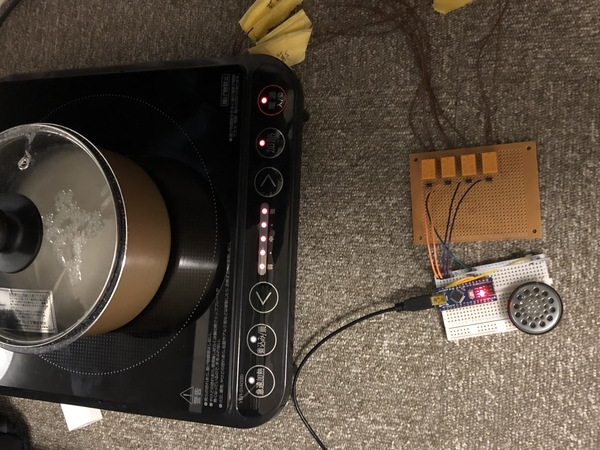

# 自動制御IHコンロ
<!--description
IHコンロをArduinoで自動制御してお米を炊いてもらう。まだ全部は書いてない
description-->
  

  
炊飯器を持っていないので<a href="../rice">フライパンで炊飯</a>をしていましたが、さすがに時間管理が面倒くさいのでArduinoに任せることにしました。
    
  

    
  
こんな感じでIHコンロのスイッチ部にリレーを付けました。

もちろん、リレーをつなげているだけなので本体はそのまま使えます。現在はusb端子をコネクタとして用いて、取り外しがしやすくなりました。usb端子だけどusbの規格でもなんでもない邪悪な端子になってしまった。(抜き差ししやすいから…)この後フォトカプラに変えたり、ESP32をつかってGoogle Homeに喋らせるようにしたりしたのでその話をそのうち書く…かも。とりあえずは電気通信大学工学研究部の部報に載せます。
    