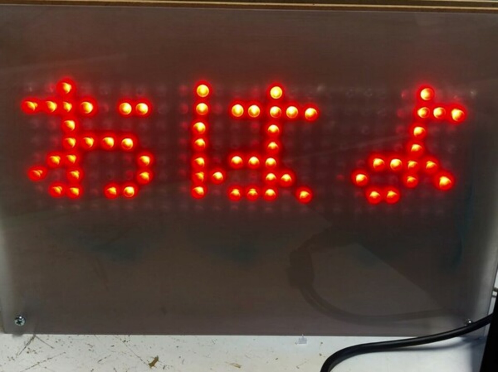
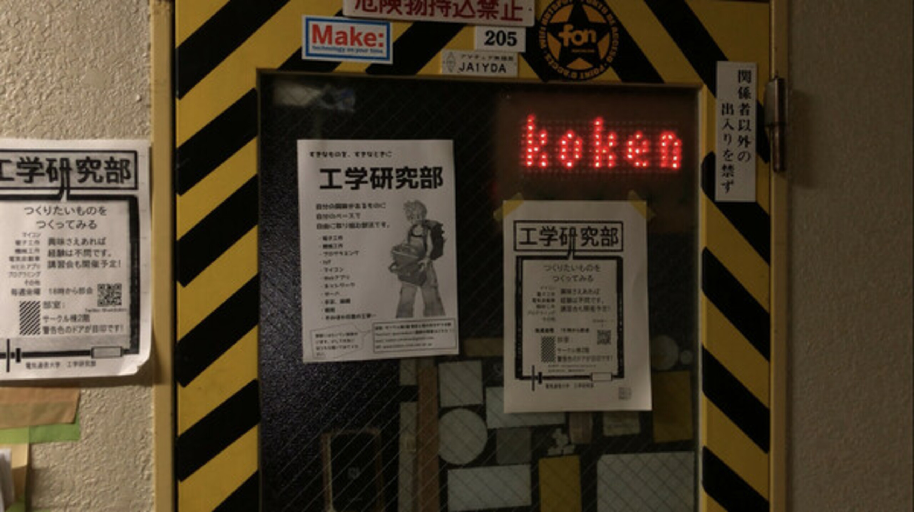
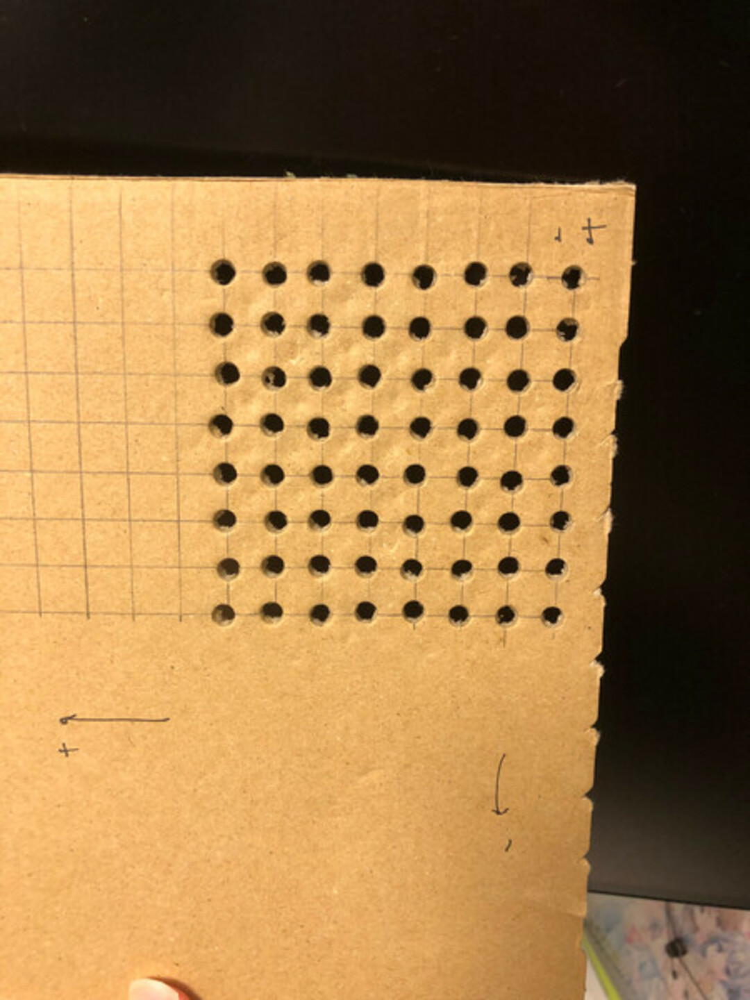
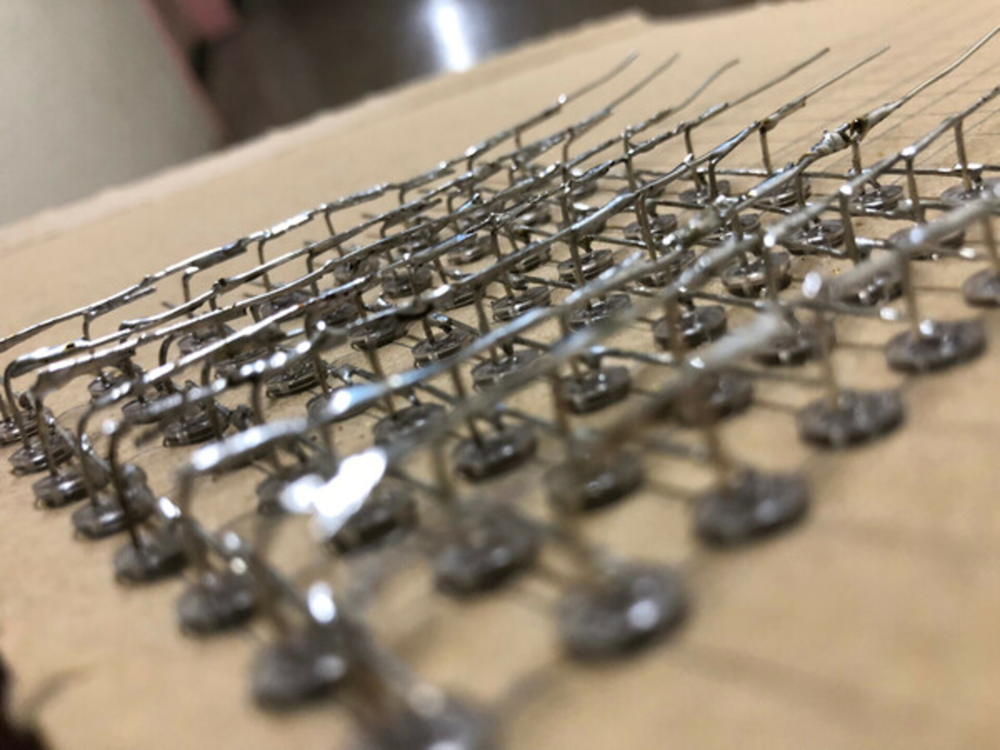
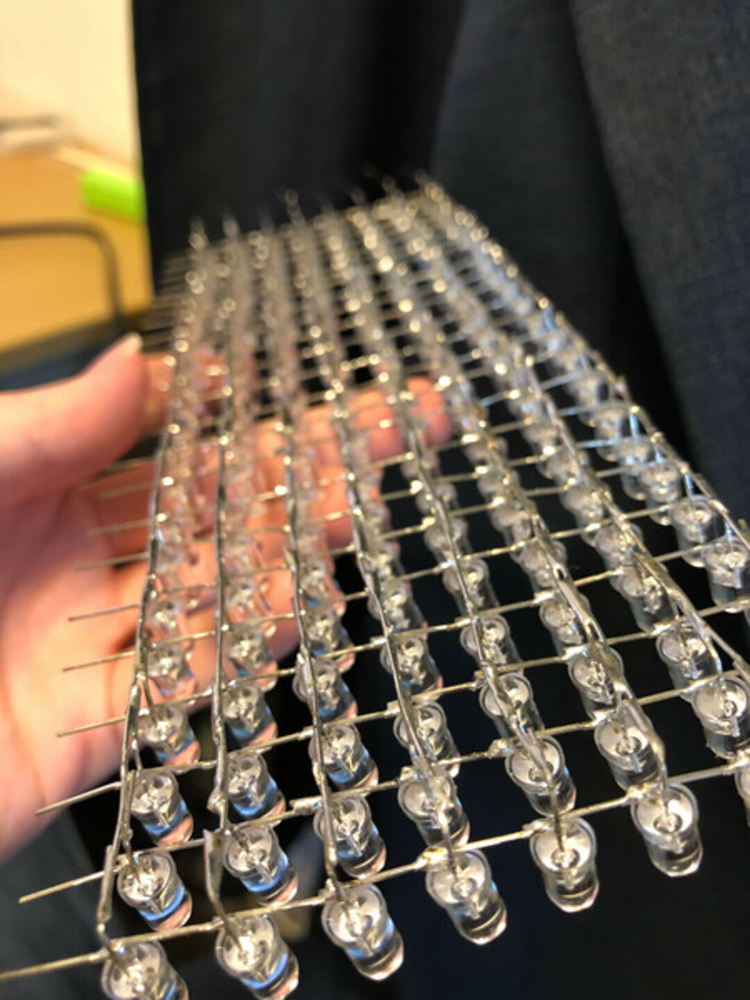

# 8*24 LED電光掲示板
<!--description
なんとなくLEDいっぱい光らせたいなと思って作った
description-->
<figure><figcaption>外観</figcaption></figure>
初めは部室のドアに取りつけたいと思い制作を始めたが、途中で小型化するのがめんどくさくなり取り付けられるようなサイズではなくなってしまった電光掲示板。制御はESP32で行っている。スマホなどで表示内容を気軽に変更できるように、内容を記したjsonファイルをHTTPでGETしてくるようにした。

追記: なんだかんだ部室に設置できました。
<figure><figcaption>部室に取り付けた様子</figcaption></figure>

<figure><figcaption>LEDはんだ付け用の台紙</figcaption></figure>
段ボールの台紙を作って、LEDをはめ込んで空中配線した様子。だいぶ苦行だった。
<figure>
  
  
  <figcaption>空中配線の様子</figcaption>
</figure>
