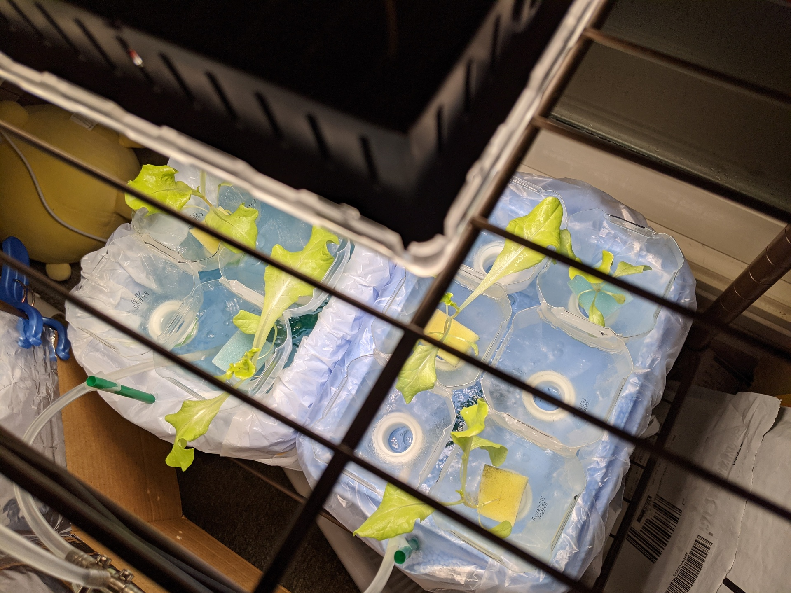

# りんりんファーム
<!--description
水耕栽培に挑戦した
description-->

## 1号機

初期の写真。構造がわかりやすい。水槽の中にビニール袋を掛けているおかげで掃除がしやすかった。

光量が足りず、成長が芳しくなかったためライトを導入した。ついでにコンセントのタイマーも買った。毎日7:00から16:00まで電源を入れた。
[Amazonのリンク](https://amzn.asia/d/caDLPvn)

ライトを導入したおかげで、レタスも育ったが藻も育った。

藻が育つのを防止するためにアルミホイルで光を遮断した。これ以降藻の被害はなくなった。ここらへんの構造は改良の余地がありそう。

最終的な外観。キャスター付きの金属ラックの上に発泡スチロールの水槽を2つ、その上の段に光源と空気を送るポンプを設置した。

ごま油と塩をかけて、そこそこ美味しくいただいた。

    
## 2号機

### 1号機からの反省と構想

1号機をつくってみた経験から思いついた改善案は以下の通り

- 水温、水量、肥料の濃度をもっときちんと管理したい
- せめて記録が取れれば改善策も考えやすい
- 定点カメラがほしい。かっこいい記録が取れるので
- もうすこし食べごたえのあるものも挑戦したい
- 以上をまとめてraspiかarduinoで管理？
- アルミホイルではなく、ちゃんとした蓋をつけたい

### 実際作ったもの

1号機でも利用していたダイソーの保冷ボックスにはもともと蓋がついていたので、そこに穴を開けてポットを設置した。ポットは3Dプリントでこちらのモデルを利用して作成した。<https://booth.pm/ja/items/3154430>

ウェブカメラを定点観測用に設置した。そのままでは画角が狭かったので、100均でスマホ向けのクリップ型になっている広角レンズを購入してウェブカメラに取り付けた。毎朝8:00に写真を撮影しdropboxにアップロードしたので、帰省中でもレタスの様子が観察できてよかった。

解決できていない改善点が多くあるが、すでに本人の興味が薄れていたためこの計画はここで終了となった。

