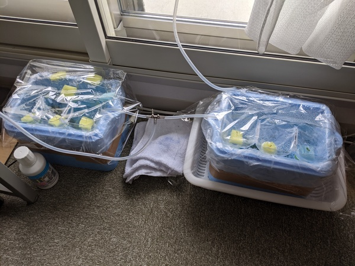
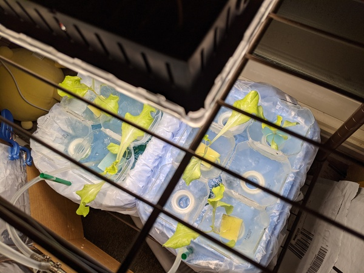
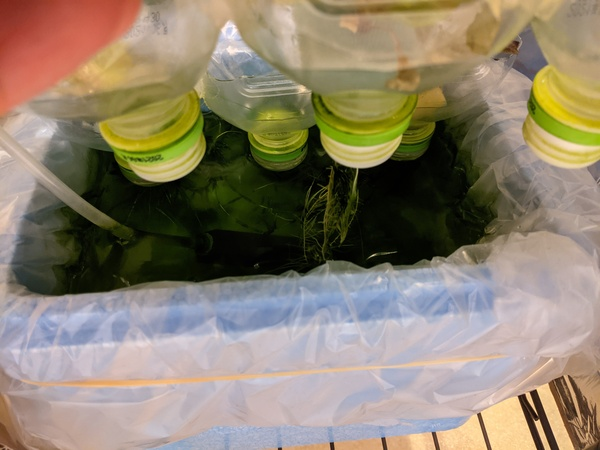
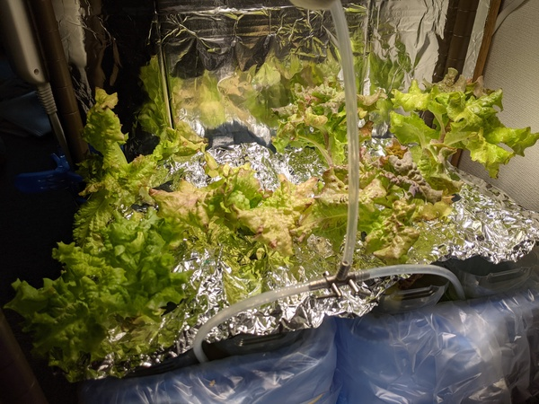
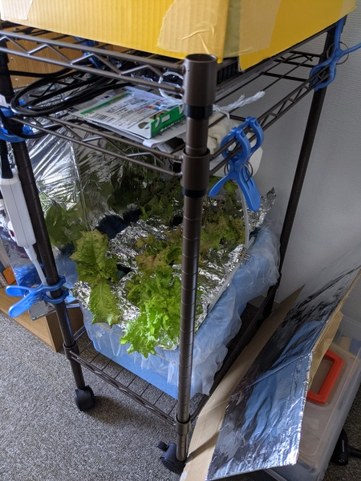
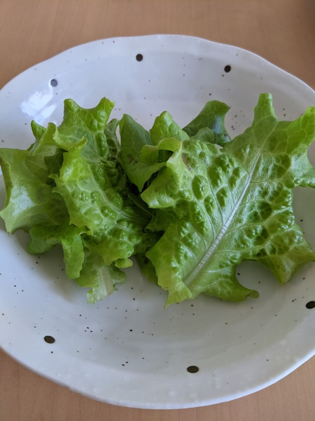

# りんりんファーム01号
<!--description
水耕栽培に挑戦した
description-->

初期の写真です。構造がわかりやすいですね。水槽の中にビニール袋を掛けているおかげで掃除がしやすかったです。

光量が足りず、成長が芳しくなかったのでライトを導入しました。ついでにコンセントのタイマーも買いました。毎日7:00から16:00まで電源を入れてくれます。 
<a href="https://www.amazon.co.jp/dp/B087BKZP19/ref=cm_sw_em_r_mt_dp_75QSE7JEJ76NRFHPJEAQ?_encoding=UTF8&psc=1">Amazonのリンク</a>

ライトを導入したおかげで、レタスも育ちましたが藻も育ちました。

藻が育つのを防止するためにアルミホイルで光を遮断しました。これ以降藻の被害はなくなりました。ここらへんの構造は改良の余地がありそう。

最終的な外観です。キャスター付きの金属ラックの上に発泡スチロールの水槽を2つ、その上の段に光源と空気を送るポンプがあります。

ごま油と塩をかけて、そこそこ美味しくいただきました。

## 02号の構想

- 水温、水量、肥料の濃度をもっときちんと管理したい。
- せめて記録が取れれば改善策も考えやすい
- 定点カメラがほしい。かっこいい記録が取れるので
- もうすこし食べごたえのあるものも挑戦したい
- 以上をまとめてraspiかarduinoで管理？
    
