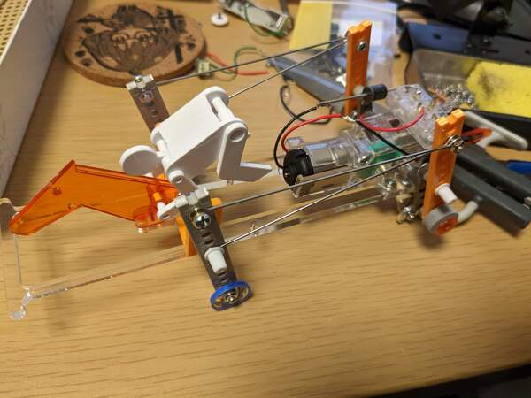
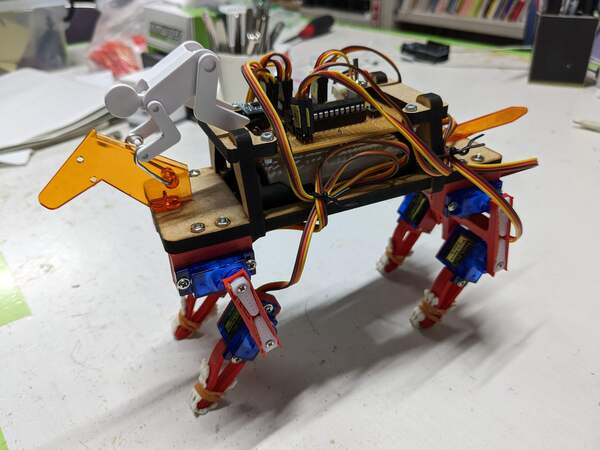

# メカダービー改造
<!--description
タミヤのメカダービーを改造した記録
description-->

## メカダービーとは

タミヤから発売されている競走馬ロボットのキットである。両後ろ足をキックさせて前に進むことができる。 
タミヤ公式ページ→<a href="https://www.tamiya.com/japan/products/71112/index.html">https://www.tamiya.com/japan/products/71112/index.html</a>

## オゼハカイザイダン
<figure><figcaption>オゼハカイザイダン</figcaption></figure>

メカダービーの両足キック走法の機構を順当に進化させた馬。重心を下げ、馬体に車輪をとりつけたことで上下方向の振動を抑え、効率的に地面を蹴る事ができるようになった。また、モーターをウルトラダッシュモーターに強化し、電源に3Vリチウム電池を利用した。

## ロボメカコーボー
<figure><figcaption>ロボメカコーボー</figcaption></figure>

四足歩行ロボット化したメカダービー。8個のサーボモータを3軸ジャイロセンサを用いてArduinoで制御した。電源に18650を2本利用している。2022年10月に電気通信大学工学研究部によって行われた調布競馬では人気投票で1位を獲得した。ロボメカ公募王である。名前の由来は電気通信大学のロボコンサークルであるロボメカ工房である。

<blockquote class="twitter-tweet">

人気投票の最終結果です。<a
    href="https://twitter.com/hashtag/%E8%AA%BF%E5%B8%83%E7%AB%B6%E9%A6%AC?src=hash&amp;ref_src=twsrc%5Etfw">#調布競馬</a>
  <a href="https://t.co/YlYrzU814N">pic.twitter.com/YlYrzU814N</a>&mdash; 電気通信大学 工学研究部 (@ueckoken) <a
  href="https://twitter.com/ueckoken/status/1585950508501827585?ref_src=twsrc%5Etfw">October 28, 2022</a>
</blockquote>

