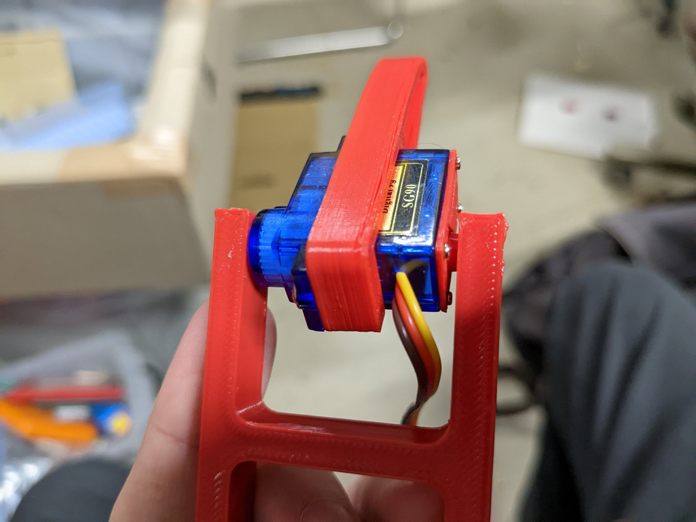
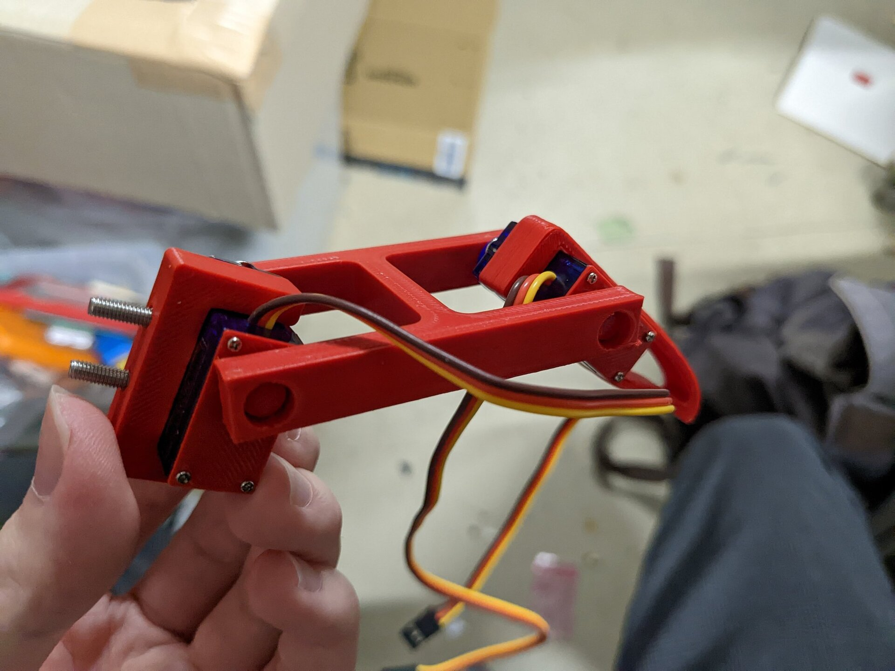

# SG90両持ちアーム
<!--description
SG90の両持ちアーム。インターネットの海にありそうでなかったので作った
description-->

  <a href="../snake/">うねうねロボ</a>を作る際に両持ちのアームが欲しかったのだが、インターネットの海にありそうでなかったので自分で作った。SG90の外装を留めている4本のネジをいったん外して、そこに重ねてネジを締めるようにした。

  
  もしひょっとして使いたい方がいらっしゃれば、個人利用の範囲でご自由にお使いください。stlファイルのダウンロードは下からどうぞ。

<https://www.thingiverse.com/thing:5890014>
