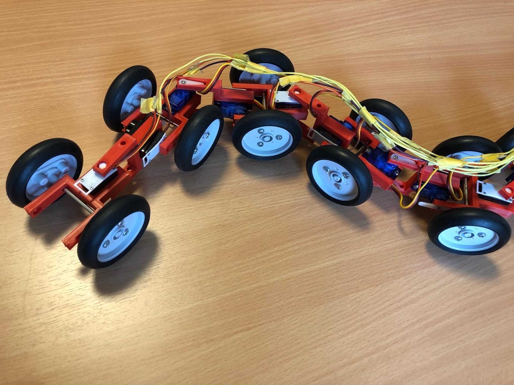

# うねうねロボット
<!--description
なんとなくうねうねしたいなと思って作った
description-->

いろいろあってなんとなくうねうねさせたくて作った。タイヤに動力は一切なく、胴体のうねうねだけで推進する。
材料は基本的に部室で拾った。アームの強度がしょぼかったり、サーボのトルクが弱かったりしてすこし残念。

## うねうねの様子
<blockquote class="twitter-tweet">

うねうね進化！だいぶ制御と呼べるようになってきた気がする🐛<a href="https://twitter.com/hashtag/%E4%BB%8A%E6%97%A5%E3%81%AE%E5%B7%A5%E7%A0%94?src=hash&amp;ref_src=twsrc%5Etfw">#今日の工研</a> <a href="https://t.co/eJKUqqia1L">pic.twitter.com/eJKUqqia1L</a>&mdash; りんりん (@lnln_ch) <a href="https://twitter.com/lnln_ch/status/1536716253103984642?ref_src=twsrc%5Etfw">June 14, 2022</a>
</blockquote>  

<iframe width="100%" height="450" src="https://www.youtube.com/embed/RXn8tjKc45I?si=AjPysR59wW2mNhLq" title="YouTube video player" frameborder="0" allow="accelerometer; autoplay; clipboard-write; encrypted-media; gyroscope; picture-in-picture; web-share" referrerpolicy="strict-origin-when-cross-origin" allowfullscreen></iframe>

