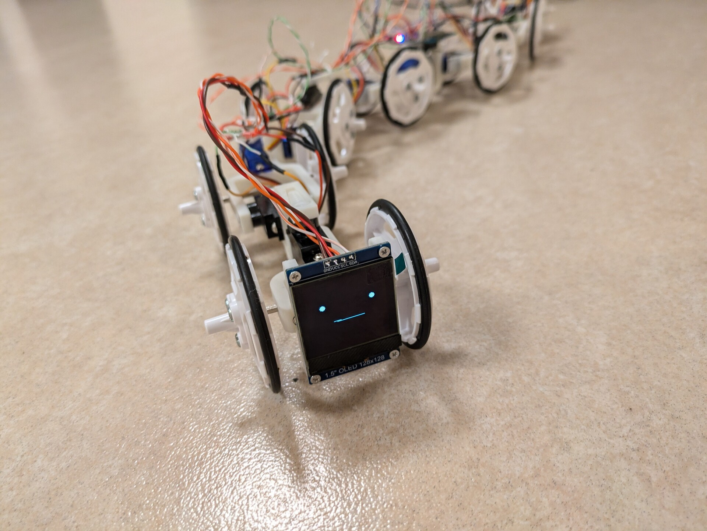
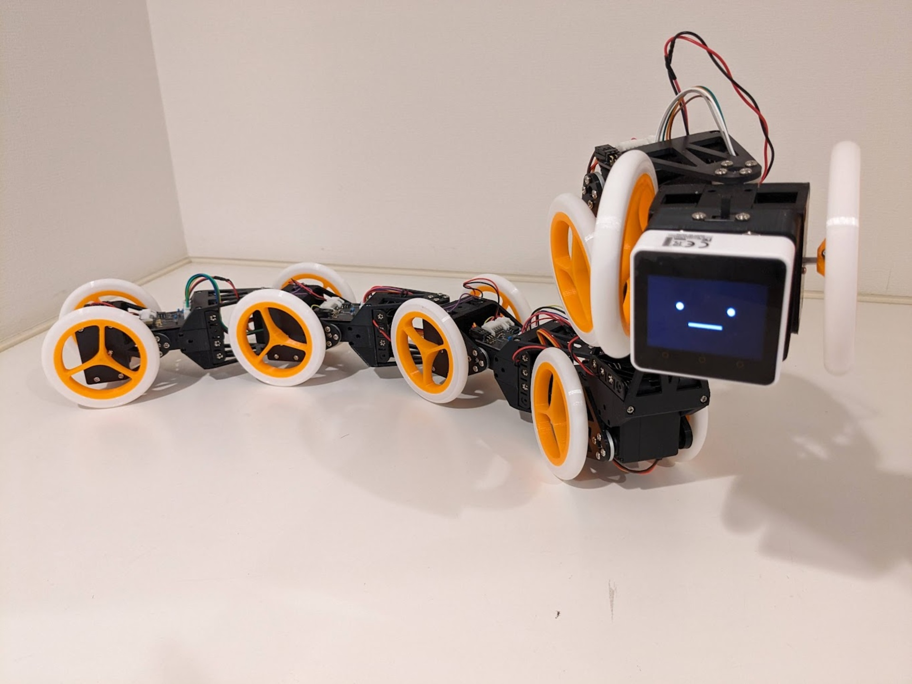

# ヘビ型ロボット
<!--description
なんとなくうねうねしたいなと思って作った
description-->

## 受動輪型
### 概要

いろいろあってなんとなくうねうねさせたくて作った。タイヤに動力はなく、胴体のうねうねだけで推進する。

v1.0は基本的に部室で拾った材料で制作した。タイヤの重さに対してアームの強度がしょぼかったり、サーボのトルクが弱かったりしてすこし残念。

v1.1ではタイヤを軽いものに変更し、v1.2で部品を白系統で統一したほか、インターネットにウケやすいように顔をつけた。

### 動画
<iframe class="w-full aspect-video mb-4" src="https://www.youtube.com/embed/cmZ5AmJDawI?si=mxvz1XSyn4JdAxoz" title="YouTube video player" frameborder="0" allow="accelerometer; autoplay; clipboard-write; encrypted-media; gyroscope; picture-in-picture; web-share" referrerpolicy="strict-origin-when-cross-origin" allowfullscreen></iframe>

<iframe class="w-full aspect-video mb-4" src="https://www.youtube.com/embed/RXn8tjKc45I?si=AjPysR59wW2mNhLq" title="YouTube video player" frameborder="0" allow="accelerometer; autoplay; clipboard-write; encrypted-media; gyroscope; picture-in-picture; web-share" referrerpolicy="strict-origin-when-cross-origin" allowfullscreen></iframe>

## 駆動輪型
### 概要

タイヤに動力がついた駆動輪型のヘビ型ロボット。シリアルサーボをケチってPWMのサーボにマイコン(CH32V003F4P6)を載せてシリアル通信してみたが、紆余曲折あって結局高くついてしまった。

1つのCH32V003でヨーピッチの2軸と、推進用モータ左右で2個の4つのモータを担当している。メインのコントローラはM5Stack Core2で、インターネット露出用に顔をつけた。

ちなみにCH32V003について少し書いた布教記事もあるのでぜひ→[CH32V003J4M6でneopixelを光らせる](/blog/2023-12-04/)

### 動画
そのうち載せる
